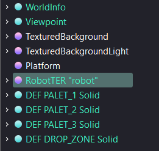
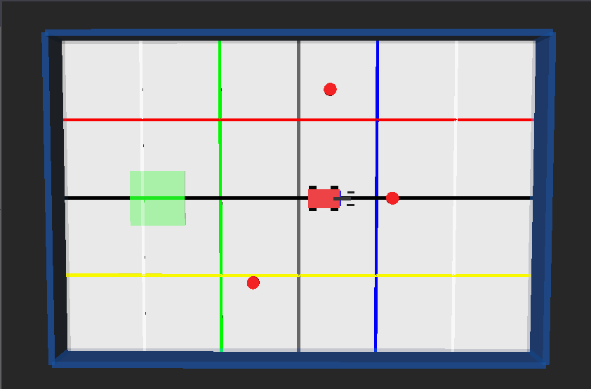

TP1 — Création du robot et prise en main de Webots
==================================================

.. contents:: Sommaire
   :depth: 3

0. Informations et objectifs
----------------------------

0.1 Contexte général du projet
~~~~~~~~~~~~~~~~~~~~~~~~~~~~~~

Ce projet consiste à réaliser et programmer un robot à l’aide du logiciel Webots.

Webots est un simulateur robotique qui permet de créer, tester et observer le comportement d’un robot dans un environnement virtuel. Il permet de manipuler un robot sans utiliser de matériel physique réel, tout en conservant une logique proche de la robotique réelle.

Dans ce projet, le robot devra être capable de réaliser une mission complète de manière autonome.

Cette mission consiste à :

* parcourir une zone de jeu ;
* rechercher des palets ;
* attraper les palets avec une pince ;
* transporter les palets ;
* déposer les palets dans une base ;
* recommencer l’action pour récupérer plusieurs palets.

Le projet est découpé en plusieurs travaux pratiques. Chaque TP ajoute progressivement une nouvelle partie du robot ou de son comportement.

Dans ce premier TP, l’objectif est de créer le robot dans Webots et de prendre en main l’interface du logiciel.

0.2 Contexte du TP
~~~~~~~~~~~~~~~~~~

Dans ce TP, vous allez créer le robot à partir de l’interface graphique de Webots.

Vous n’allez pas encore programmer le comportement complet du robot. Le but est d’abord de comprendre comment un robot est construit dans Webots.

Vous allez créer progressivement :

* le corps du robot ;
* les quatre roues ;
* les moteurs des roues ;
* les capteurs de distance ;
* un capteur de contact ;
* une caméra couleur ;
* un bras ;
* une pince ;
* un premier contrôleur simple pour tester le déplacement.

À la fin du TP, le robot devra pouvoir avancer dans la simulation grâce à un controller Java minimal.

0.3 Matériel et outils nécessaires
~~~~~~~~~~~~~~~~~~~~~~~~~~~~~~~~~~

Pour réaliser ce TP, vous devez disposer de :

* Webots ;
* Visual Studio Code ;
* Java ;
* le projet Webots fourni ;
* un terminal Windows PowerShell ou l’invite de commande.

Liens utiles :

* Webots : https://www.cyberbotics.com/
* Visual Studio Code : https://code.visualstudio.com/
* Documentation Webots : https://cyberbotics.com/doc/reference/index
* Documentation Java : https://docs.oracle.com/en/java/
* Documentation du projet : https://ter-projet-robotique.readthedocs.io/en/latest/index.html

0.4 Objectifs de la séance
~~~~~~~~~~~~~~~~~~~~~~~~~~

À la fin de cette séance, vous serez capables de :

* ouvrir un monde Webots ;
* manipuler l’arborescence du monde ;
* ajouter des nœuds depuis l’interface ;
* modifier les champs d’un nœud ;
* créer un robot simple ;
* ajouter des roues et des moteurs ;
* ajouter des capteurs ;
* associer un controller Java au robot ;
* lancer une première simulation.

0.5 Fonctionnement de Webots
~~~~~~~~~~~~~~~~~~~~~~~~~~~~

Webots est organisé autour de plusieurs éléments :

* le monde, qui représente la scène de simulation ;
* les nœuds, qui représentent les objets de la scène ;
* les champs, qui sont les propriétés des nœuds ;
* les PROTO, qui permettent de créer des objets réutilisables ;
* les controllers, qui permettent de programmer les robots.

0.5.1 Arborescence du monde
^^^^^^^^^^^^^^^^^^^^^^^^^^^

Sur la partie gauche de Webots se trouve l’arborescence du monde.

Elle contient tous les objets présents dans la simulation.

On peut par exemple y retrouver :

* ``WorldInfo`` ;
* ``Viewpoint`` ;
* ``TexturedBackground`` ;
* ``TexturedBackgroundLight`` ;
* ``Floor`` ;
* ``Robot`` ;
* des objets comme les palets ou la zone de dépôt.

   Figure 1 — Arborescence du monde dans Webots.

Image à mettre : capture de la partie gauche de Webots avec l’arborescence visible.

0.5.2 Zone de visualisation
^^^^^^^^^^^^^^^^^^^^^^^^^^^

Au centre de Webots se trouve la zone de visualisation.

Elle permet d’observer :

* la scène ;
* le robot ;
* le sol ;
* les objets ;
* les déplacements pendant la simulation.

   Figure 2 — Zone de visualisation dans Webots.

Image à mettre : capture de la scène Webots avec le sol et le robot.

0.5.3 Panneau d’édition des champs
^^^^^^^^^^^^^^^^^^^^^^^^^^^^^^^^^^

Lorsqu’un nœud est sélectionné dans l’arborescence, ses champs peuvent être modifiés.

Les champs les plus utilisés dans ce TP sont :

* ``translation`` ;
* ``rotation`` ;
* ``children`` ;
* ``name`` ;
* ``controller`` ;
* ``boundingObject`` ;
* ``physics``.

.. figure:: images/tp1_champs_noeud.png
   :alt: Champs d’un nœud Webots
   :align: center
   :width: 80%

   Figure 3 — Exemple de champs modifiables dans Webots.

Image à mettre : capture des champs d’un nœud sélectionné.

1. Mise en place du projet
--------------------------

1.1 Récupération du projet
~~~~~~~~~~~~~~~~~~~~~~~~~~

Commencez par récupérer le projet depuis le dépôt Git fourni.

Ouvrez un terminal et placez-vous dans le dossier où vous souhaitez enregistrer le projet.

Utilisez ensuite la commande suivante :

.. code-block:: bash

   git clone https://github.com/AlexMarchetto/TER---Projet-Robotique.git

Placez-vous dans le dossier du projet :

.. code-block:: bash

   cd TER---Projet-Robotique

1.2 Organisation attendue
~~~~~~~~~~~~~~~~~~~~~~~~~

Le projet doit contenir au minimum les dossiers suivants :

.. code-block:: text

   TER---Projet-Robotique/
   ├── controllers/
   ├── protos/
   ├── worlds/
   └── README.md

Le dossier ``worlds`` contient les mondes Webots.

Le dossier ``controllers`` contient les programmes Java.

Le dossier ``protos`` contient les fichiers de modèles réutilisables.

1.3 Ouverture du monde
~~~~~~~~~~~~~~~~~~~~~~

Lancez Webots.

Ouvrez le fichier :

.. code-block:: text

   worlds/main.wbt

Si le monde n’existe pas encore, créez un nouveau monde Webots vide, puis enregistrez-le dans le dossier ``worlds`` sous le nom :

.. code-block:: text

   main.wbt

2. Création du monde de test
----------------------------

Avant de créer le robot, il faut disposer d’un environnement simple.

2.1 Ajouter un sol
~~~~~~~~~~~~~~~~~~

Dans l’arborescence du monde :

1. faites un clic droit sur la scène ;
2. choisissez ``Add New`` ;
3. recherchez ``Floor`` ;
4. ajoutez le nœud ``Floor``.

Modifiez ensuite le champ ``size`` du sol avec une taille suffisante, par exemple :

.. code-block:: text

   2 2

Le sol représente la surface sur laquelle le robot va se déplacer.

.. figure:: images/tp1_ajout_floor.png
   :alt: Ajout du sol dans Webots
   :align: center
   :width: 80%

   Figure 4 — Ajout du sol dans Webots.

Image à mettre : capture du menu d’ajout ou du sol visible dans la scène.

2.2 Ajouter l’arrière-plan et la lumière
~~~~~~~~~~~~~~~~~~~~~~~~~~~~~~~~~~~~~~~

Ajoutez les nœuds suivants si nécessaire :

* ``TexturedBackground`` ;
* ``TexturedBackgroundLight``.

Ces nœuds permettent d’obtenir une scène plus lisible.

2.3 Ajouter un point de vue
~~~~~~~~~~~~~~~~~~~~~~~~~~~

Le nœud ``Viewpoint`` permet de définir la caméra utilisée pour observer la scène.

Vous pouvez le déplacer depuis l’interface afin d’obtenir une vue globale du robot.

3. Création du robot
--------------------

Dans cette partie, vous allez créer le robot depuis l’interface Webots.

3.1 Ajouter un nœud Robot
~~~~~~~~~~~~~~~~~~~~~~~~~

Dans l’arborescence :

1. faites un clic droit sur la scène ;
2. choisissez ``Add New`` ;
3. recherchez ``Robot`` ;
4. ajoutez un nœud ``Robot``.

Renommez le robot si besoin, par exemple :

.. code-block:: text

   RobotTER

Dans les champs du robot, modifiez :

.. code-block:: text

   translation 0 0 0.04
   rotation 0 0 1 0

Le robot est maintenant placé au centre de la scène.

.. figure:: images/tp1_ajout_robot.png
   :alt: Ajout d’un nœud Robot
   :align: center
   :width: 80%

   Figure 5 — Ajout du robot dans la scène.

Image à mettre : capture du robot ajouté dans l’arborescence.

3.2 Associer un controller au robot
~~~~~~~~~~~~~~~~~~~~~~~~~~~~~~~~~~~

Sélectionnez le nœud ``Robot``.

Dans le champ ``controller``, indiquez :

.. code-block:: text

   FourWheelsCollisionAvoidance

Ce controller sera créé plus tard dans le TP.

Si le champ ``controller`` n’est pas visible, vérifiez que vous avez bien sélectionné le nœud ``Robot`` et non un autre objet.

3.3 Activer le mode Supervisor
~~~~~~~~~~~~~~~~~~~~~~~~~~~~~~

Dans les champs du robot, trouvez le champ :

.. code-block:: text

   supervisor

Mettez sa valeur à :

.. code-block:: text

   TRUE

Cela permettra plus tard au robot d’accéder aux objets de la scène, comme les palets.

4. Création du corps du robot
-----------------------------

4.1 Ajouter une forme au robot
~~~~~~~~~~~~~~~~~~~~~~~~~~~~~~

Dans l’arborescence, ouvrez le nœud ``Robot``.

Dans le champ ``children`` du robot :

1. cliquez sur le bouton permettant d’ajouter un nouveau nœud ;
2. ajoutez un nœud ``Shape``.

Ce ``Shape`` représentera le corps du robot.

4.2 Modifier l’apparence
~~~~~~~~~~~~~~~~~~~~~~~~

Dans le nœud ``Shape``, ajoutez ou modifiez le champ ``appearance`` avec un ``PBRAppearance``.

Choisissez une couleur rouge, par exemple :

.. code-block:: text

   baseColor 0.9 0.1 0.1

4.3 Modifier la géométrie
~~~~~~~~~~~~~~~~~~~~~~~~~

Dans le champ ``geometry`` du ``Shape``, ajoutez une ``Box``.

Modifiez sa taille :

.. code-block:: text

   size 0.2 0.1 0.05

Le corps du robot mesure donc environ :

* 20 cm de longueur ;
* 10 cm de largeur ;
* 5 cm de hauteur.

.. figure:: images/tp1_corps_robot.png
   :alt: Corps du robot
   :align: center
   :width: 70%

   Figure 6 — Corps du robot après ajout d’une boîte.

Image à mettre : capture du corps rouge du robot.

4.4 Ajouter le boundingObject du robot
~~~~~~~~~~~~~~~~~~~~~~~~~~~~~~~~~~~~~~

Sélectionnez le nœud ``Robot``.

Dans le champ ``boundingObject``, ajoutez une ``Box``.

Mettez la même taille que le corps :

.. code-block:: text

   size 0.2 0.1 0.05

Le ``boundingObject`` permet à Webots de gérer les collisions du robot.

4.5 Ajouter la physique du robot
~~~~~~~~~~~~~~~~~~~~~~~~~~~~~~~~

Sélectionnez le nœud ``Robot``.

Dans le champ ``physics``, ajoutez un nœud ``Physics``.

Définissez une masse, par exemple :

.. code-block:: text

   mass 1

La physique permet au robot d’interagir correctement avec le sol et les objets.

5. Création des roues
---------------------

Le robot doit posséder quatre roues.

Chaque roue doit être ajoutée sous la forme d’un ``HingeJoint``.

Un ``HingeJoint`` permet de créer une articulation rotative.

Chaque roue contiendra :

* un ``HingeJoint`` ;
* un ``RotationalMotor`` ;
* un ``Solid`` ;
* un ``Shape`` ;
* un ``Cylinder`` ;
* un ``boundingObject`` ;
* un ``Physics``.

5.1 Positions des roues
~~~~~~~~~~~~~~~~~~~~~~~

Les roues doivent être placées aux positions suivantes :

.. list-table::
   :header-rows: 1

   * - Roue
     - Nom du moteur
     - Position
   * - Avant gauche
     - ``wheel1``
     - ``0.07 0.06 0``
   * - Avant droite
     - ``wheel2``
     - ``0.07 -0.06 0``
   * - Arrière gauche
     - ``wheel3``
     - ``-0.07 0.06 0``
   * - Arrière droite
     - ``wheel4``
     - ``-0.07 -0.06 0``

5.2 Ajouter la première roue
~~~~~~~~~~~~~~~~~~~~~~~~~~~~

Dans le champ ``children`` du robot :

1. ajoutez un nœud ``HingeJoint`` ;
2. ouvrez le champ ``jointParameters`` ;
3. ajoutez ou modifiez ``HingeJointParameters`` ;
4. définissez le champ ``anchor`` à :

.. code-block:: text

   0.07 0.06 0

5.3 Définir l’axe de rotation
~~~~~~~~~~~~~~~~~~~~~~~~~~~~~

Dans les paramètres du ``HingeJoint``, définissez l’axe de rotation :

.. code-block:: text

   axis 0 1 0

Cet axe permet à la roue de tourner correctement sur le côté du robot.

5.4 Ajouter le moteur de la roue
~~~~~~~~~~~~~~~~~~~~~~~~~~~~~~~~

Dans le champ ``device`` du ``HingeJoint`` :

1. ajoutez un ``RotationalMotor`` ;
2. donnez-lui le nom :

.. code-block:: text

   wheel1

Le nom du moteur est très important. Il sera utilisé dans le controller Java.

5.5 Ajouter la partie visible de la roue
~~~~~~~~~~~~~~~~~~~~~~~~~~~~~~~~~~~~~~~

Dans le champ ``endPoint`` du ``HingeJoint`` :

1. ajoutez un nœud ``Solid`` ;
2. mettez sa translation à :

.. code-block:: text

   0.07 0.06 0

3. ajoutez une rotation :

.. code-block:: text

   1 0 0 1.5708

Dans les ``children`` du ``Solid`` :

1. ajoutez un ``Shape`` ;
2. ajoutez une ``PBRAppearance`` noire ;
3. ajoutez une géométrie ``Cylinder``.

Paramètres du cylindre :

.. code-block:: text

   radius 0.025
   height 0.02

5.6 Ajouter les collisions et la physique de la roue
~~~~~~~~~~~~~~~~~~~~~~~~~~~~~~~~~~~~~~~~~~~~~~~~~~~~

Dans le ``Solid`` de la roue :

1. ajoutez un ``boundingObject`` de type ``Cylinder`` ;
2. mettez les mêmes dimensions :

.. code-block:: text

   radius 0.025
   height 0.02

3. ajoutez un nœud ``Physics`` ;
4. mettez une masse :

.. code-block:: text

   mass 0.05

5.7 Créer les trois autres roues
~~~~~~~~~~~~~~~~~~~~~~~~~~~~~~~~

Répétez les étapes précédentes pour les trois autres roues.

Pensez à modifier :

* la position ;
* le nom du moteur ;
* le nom du nœud si vous choisissez de le nommer.

Les noms attendus sont :

.. code-block:: text

   wheel1
   wheel2
   wheel3
   wheel4

.. figure:: images/tp1_roues_robot.png
   :alt: Robot avec quatre roues
   :align: center
   :width: 70%

   Figure 7 — Robot avec ses quatre roues.

Image à mettre : capture du robot avec les quatre roues visibles.

6. Ajout des capteurs
---------------------

6.1 Capteurs de distance
~~~~~~~~~~~~~~~~~~~~~~~~

Le robot utilise trois capteurs de distance :

.. code-block:: text

   ds_front
   ds_left
   ds_right

Ces capteurs permettent de détecter les obstacles devant ou sur les côtés du robot.

6.2 Ajouter le capteur frontal
~~~~~~~~~~~~~~~~~~~~~~~~~~~~~~

Dans les ``children`` du robot :

1. ajoutez un nœud ``DistanceSensor`` ;
2. donnez-lui le nom :

.. code-block:: text

   ds_front

3. définissez sa translation :

.. code-block:: text

   0.11 0 0.02

4. définissez sa rotation :

.. code-block:: text

   0 0 1 0

5. ajoutez une ``lookupTable`` :

.. code-block:: text

   0 0 0
   0.3 1000 0

6.3 Ajouter les capteurs gauche et droit
~~~~~~~~~~~~~~~~~~~~~~~~~~~~~~~~~~~~~~~~

Ajoutez ensuite deux autres capteurs.

Capteur gauche :

.. code-block:: text

   name ds_left
   translation 0.04 0.055 0.02
   rotation 0 0 1 1.5708

Capteur droit :

.. code-block:: text

   name ds_right
   translation 0.04 -0.055 0.02
   rotation 0 0 1 -1.5708

Utilisez la même ``lookupTable`` pour les trois capteurs.

.. figure:: images/tp1_capteurs_distance.png
   :alt: Capteurs de distance du robot
   :align: center
   :width: 70%

   Figure 8 — Position des capteurs de distance.

Image à mettre : capture avec les capteurs de distance visibles ou entourés.

6.4 Ajouter le capteur de contact
~~~~~~~~~~~~~~~~~~~~~~~~~~~~~~~~~

Le capteur de contact permet de détecter une collision à l’avant du robot.

Dans les ``children`` du robot :

1. ajoutez un nœud ``TouchSensor`` ;
2. donnez-lui le nom :

.. code-block:: text

   touch_front

3. mettez sa translation :

.. code-block:: text

   0.12 0 0.02

4. mettez son type à :

.. code-block:: text

   bumper

5. ajoutez un ``boundingObject`` de type ``Box`` ;
6. donnez à cette boîte la taille :

.. code-block:: text

   size 0.02 0.08 0.03

.. figure:: images/tp1_touch_sensor.png
   :alt: Capteur de contact du robot
   :align: center
   :width: 70%

   Figure 9 — Capteur de contact placé à l’avant.

Image à mettre : capture du capteur ``touch_front`` à l’avant du robot.

6.5 Ajouter la caméra couleur
~~~~~~~~~~~~~~~~~~~~~~~~~~~~~

La caméra permet de lire la couleur située devant le robot.

Dans les ``children`` du robot :

1. ajoutez un nœud ``Camera`` ;
2. donnez-lui le nom :

.. code-block:: text

   color_sensor

3. mettez sa translation :

.. code-block:: text

   0.11 0 0.04

4. mettez sa rotation :

.. code-block:: text

   0 0 1 0

5. réglez sa taille :

.. code-block:: text

   width 32
   height 32

6. réglez son champ de vision :

.. code-block:: text

   fieldOfView 0.7

.. figure:: images/tp1_camera_couleur.png
   :alt: Caméra couleur du robot
   :align: center
   :width: 70%

   Figure 10 — Caméra couleur placée à l’avant du robot.

Image à mettre : capture de la caméra couleur.

7. Ajout du bras et de la pince
-------------------------------

7.1 Ajouter le bras
~~~~~~~~~~~~~~~~~~~

Le bras est une articulation qui permettra plus tard de baisser ou relever la pince.

Dans les ``children`` du robot :

1. ajoutez un nœud ``HingeJoint`` ;
2. dans ``jointParameters``, définissez :

.. code-block:: text

   anchor 0.09 0 0.04
   axis 0 1 0

3. dans ``device``, ajoutez un ``RotationalMotor`` nommé :

.. code-block:: text

   arm_motor

4. ajoutez aussi un ``PositionSensor`` nommé :

.. code-block:: text

   arm_sensor

5. dans ``endPoint``, ajoutez un ``Solid`` ;
6. donnez au ``Solid`` la translation :

.. code-block:: text

   0.12 0 0.03

7. ajoutez un ``Shape`` avec une ``Box`` de taille :

.. code-block:: text

   size 0.08 0.02 0.02

8. ajoutez un ``boundingObject`` de même taille ;
9. ajoutez une physique avec une masse de ``0.05``.

.. figure:: images/tp1_bras_robot.png
   :alt: Bras du robot
   :align: center
   :width: 70%

   Figure 11 — Bras du robot.

Image à mettre : capture du bras placé à l’avant.

7.2 Ajouter la pince gauche
~~~~~~~~~~~~~~~~~~~~~~~~~~~

Dans les ``children`` du robot :

1. ajoutez un ``HingeJoint`` ;
2. définissez les paramètres :

.. code-block:: text

   anchor 0.16 0.025 0.03
   axis 0 0 1

3. ajoutez un ``RotationalMotor`` nommé :

.. code-block:: text

   gripper_left_motor

4. ajoutez un ``Solid`` en ``endPoint`` ;
5. mettez sa translation :

.. code-block:: text

   0.17 0.035 0.03

6. ajoutez un ``Shape`` avec une boîte de taille :

.. code-block:: text

   size 0.05 0.01 0.015

7. ajoutez un ``boundingObject`` de même taille ;
8. ajoutez une physique avec une masse de ``0.02``.

7.3 Ajouter la pince droite
~~~~~~~~~~~~~~~~~~~~~~~~~~~

Répétez les étapes précédentes pour la pince droite.

Modifiez les valeurs suivantes :

.. code-block:: text

   anchor 0.16 -0.025 0.03
   translation 0.17 -0.035 0.03
   motor name gripper_right_motor

.. figure:: images/tp1_pince_robot.png
   :alt: Pince du robot
   :align: center
   :width: 70%

   Figure 12 — Pince du robot.

Image à mettre : capture de la pince complète.

8. Premier controller de test
-----------------------------

Le robot est maintenant créé dans Webots.

Pour vérifier que les roues fonctionnent, nous allons utiliser un controller très simple.

8.1 Créer le dossier du controller
~~~~~~~~~~~~~~~~~~~~~~~~~~~~~~~~~~

Dans le dossier ``controllers``, créez le dossier suivant :

.. code-block:: text

   FourWheelsCollisionAvoidance

Dans ce dossier, créez le fichier :

.. code-block:: text

   FourWheelsCollisionAvoidance.java

L’organisation doit être la suivante :

.. code-block:: text

   controllers/
   └── FourWheelsCollisionAvoidance/
       └── FourWheelsCollisionAvoidance.java

8.2 Code du controller
~~~~~~~~~~~~~~~~~~~~~~

Copiez le code suivant dans le fichier ``FourWheelsCollisionAvoidance.java`` :

.. code-block:: java

   import com.cyberbotics.webots.controller.Robot;
   import com.cyberbotics.webots.controller.Motor;

   public class FourWheelsCollisionAvoidance {
     public static void main(String[] args) {
       Robot robot = new Robot();

       int timeStep = (int) Math.round(robot.getBasicTimeStep());

       Motor wheel1 = robot.getMotor("wheel1");
       Motor wheel2 = robot.getMotor("wheel2");
       Motor wheel3 = robot.getMotor("wheel3");
       Motor wheel4 = robot.getMotor("wheel4");

       Motor[] wheels = { wheel1, wheel2, wheel3, wheel4 };

       for (int i = 0; i < wheels.length; i++) {
         if (wheels[i] != null) {
           wheels[i].setPosition(Double.POSITIVE_INFINITY);
           wheels[i].setVelocity(0.0);
         }
       }

       while (robot.step(timeStep) != -1) {
         double leftSpeed = 2.0;
         double rightSpeed = 2.0;

         if (wheel1 != null) {
           wheel1.setVelocity(leftSpeed);
         }

         if (wheel2 != null) {
           wheel2.setVelocity(rightSpeed);
         }

         if (wheel3 != null) {
           wheel3.setVelocity(leftSpeed);
         }

         if (wheel4 != null) {
           wheel4.setVelocity(rightSpeed);
         }
       }
     }
   }

Ce code permet uniquement de faire avancer le robot.

Il sert à vérifier que :

* les moteurs sont correctement nommés ;
* les roues sont correctement placées ;
* le controller est bien associé au robot ;
* le robot peut se déplacer.

8.3 Compiler le controller
~~~~~~~~~~~~~~~~~~~~~~~~~~

Ouvrez un terminal dans le dossier :

.. code-block:: text

   controllers/FourWheelsCollisionAvoidance/

Compilez le fichier Java avec :

.. code-block:: powershell

   javac --release 8 -cp "C:\Program Files\Webots\lib\controller\java\Controller.jar" FourWheelsCollisionAvoidance.java

Si cette commande ne fonctionne pas, essayez :

.. code-block:: powershell

   javac -cp "C:\Program Files\Webots\lib\controller\java\Controller.jar" FourWheelsCollisionAvoidance.java

Si la compilation fonctionne, un fichier ``FourWheelsCollisionAvoidance.class`` est créé.

9. Test final
-------------

Lancez la simulation dans Webots.

Le robot doit avancer en ligne droite.

Vérifiez que :

* le robot apparaît dans la scène ;
* le robot possède quatre roues ;
* les roues tournent ;
* le robot avance ;
* le robot ne tombe pas ;
* le robot ne traverse pas le sol ;
* aucun message d’erreur important n’apparaît dans la console.

.. figure:: images/tp1_test_final_robot.png
   :alt: Test final du robot
   :align: center
   :width: 80%

   Figure 13 — Test final du robot dans Webots.

Image à mettre : capture du robot en train d’avancer dans la scène.

10. Travail à rendre
--------------------

À la fin du TP1, le robot doit être entièrement créé dans Webots.

Le robot doit posséder :

* un corps ;
* quatre roues ;
* quatre moteurs de roues ;
* trois capteurs de distance ;
* un capteur de contact ;
* une caméra couleur ;
* un bras ;
* une pince ;
* un controller Java associé.

Vous devez aussi être capables d’expliquer :

* le rôle d’un nœud ``Robot`` ;
* le rôle d’un ``Shape`` ;
* le rôle d’un ``HingeJoint`` ;
* le rôle d’un ``RotationalMotor`` ;
* le rôle d’un ``DistanceSensor`` ;
* le rôle d’un ``TouchSensor`` ;
* le rôle d’une ``Camera`` ;
* le rôle du ``boundingObject`` ;
* le rôle de ``Physics`` ;
* le rôle du champ ``controller``.

11. Questions de compréhension
------------------------------

Répondez brièvement aux questions suivantes :

1. À quoi sert le nœud ``Robot`` ?
2. Pourquoi faut-il ajouter un ``boundingObject`` au robot ?
3. Pourquoi faut-il ajouter une physique au robot ?
4. À quoi sert un ``HingeJoint`` ?
5. Pourquoi les roues ont-elles besoin d’un ``RotationalMotor`` ?
6. Pourquoi les noms ``wheel1``, ``wheel2``, ``wheel3`` et ``wheel4`` sont-ils importants ?
7. Quelle est la différence entre un ``DistanceSensor`` et un ``TouchSensor`` ?
8. Pourquoi le controller Java doit-il porter le même nom que le dossier du controller ?
9. Pourquoi faut-il tester le robot après chaque grande étape ?
10. Que peut-il se passer si une roue est mal placée ?

Annexes
-------

Annexe A — Schéma simplifié du robot
~~~~~~~~~~~~~~~~~~~~~~~~~~~~~~~~~~~~

.. figure:: images/tp1_schema_robot.png
   :alt: Schéma simplifié du robot
   :align: center
   :width: 70%

   Figure 14 — Schéma simplifié du robot vu du dessus.

Image à mettre : schéma du robot vu du dessus avec les roues, les capteurs et la pince.

Exemple de schéma :

.. code-block:: text

                  ds_front
                     ↓
          ┌─────────────────────┐
          │                     │
 ds_left ←│       CORPS         │→ ds_right
          │                     │
          └─────────────────────┘

             ○               ○
           wheel1          wheel2

             ○               ○
           wheel3          wheel4

              Bras + pince à l’avant
              touch_front devant la pince

Annexe B — Problèmes fréquents
~~~~~~~~~~~~~~~~~~~~~~~~~~~~~~

Le robot n’apparaît pas
^^^^^^^^^^^^^^^^^^^^^^^

Vérifiez que le nœud ``Robot`` est bien présent dans l’arborescence.

Vérifiez aussi que sa position n’est pas trop basse ou trop haute.

Le robot tombe ou traverse le sol
^^^^^^^^^^^^^^^^^^^^^^^^^^^^^^^^^

Vérifiez que le robot possède :

* un ``boundingObject`` ;
* un nœud ``Physics`` ;
* une masse correcte ;
* une position au-dessus du sol.

Une roue ne tourne pas
^^^^^^^^^^^^^^^^^^^^^^

Vérifiez que :

* la roue possède un ``RotationalMotor`` ;
* le moteur porte le bon nom ;
* le controller Java utilise exactement le même nom ;
* la roue possède une physique.

Le robot n’avance pas droit
^^^^^^^^^^^^^^^^^^^^^^^^^^^

Vérifiez que les roues sont placées de manière symétrique.

Vérifiez aussi que les roues de gauche utilisent bien la même vitesse et que les roues de droite utilisent bien la même vitesse.

Le controller ne se lance pas
^^^^^^^^^^^^^^^^^^^^^^^^^^^^^

Vérifiez que :

* le champ ``controller`` du robot contient ``FourWheelsCollisionAvoidance`` ;
* le dossier du controller porte le même nom ;
* le fichier Java porte le même nom ;
* la classe Java s’appelle ``FourWheelsCollisionAvoidance`` ;
* le fichier Java a bien été compilé.

Un capteur ne fonctionne pas
^^^^^^^^^^^^^^^^^^^^^^^^^^^^

Vérifiez que le nom du capteur dans Webots correspond au nom utilisé dans le code Java.

Exemple :

.. code-block:: java

   robot.getDistanceSensor("ds_front");

Le capteur doit donc s’appeler exactement :

.. code-block:: text

   ds_front

Conclusion
----------

Dans ce premier TP, vous avez créé un robot complet dans Webots à l’aide de l’interface graphique.

Vous avez ajouté :

* le corps du robot ;
* les roues ;
* les moteurs ;
* les capteurs ;
* le bras ;
* la pince ;
* un controller Java simple.

Le robot est maintenant prêt pour les prochains TP.

Dans le TP2, vous apprendrez à utiliser les moteurs, les capteurs et la pince depuis le code Java.