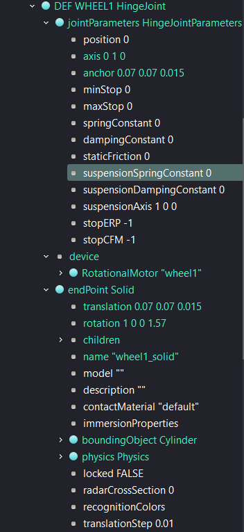
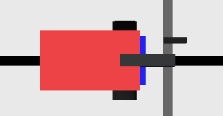
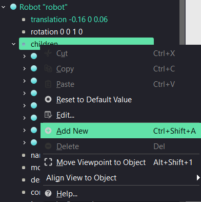

# Projet robotique sur Webots — TP1

## Finalisation du robot et prise en main

> **Objectif général :** découvrir Webots, comprendre la structure d’un robot dans l’arborescence, ajouter des composants depuis l’interface graphique, puis vérifier le robot avec un contrôleur de validation.

---

## Sommaire

- [I. Informations et objectifs](#i-informations-et-objectifs)
  - [1. Contexte général du projet](#1-contexte-général-du-projet)
  - [2. Contexte du TP](#2-contexte-du-tp)
  - [3. Matériel et outils nécessaires](#3-matériel-et-outils-nécessaires)
  - [4. Objectifs de la séance](#4-objectifs-de-la-séance)
- [II. Fonctionnement de Webots](#ii-fonctionnement-de-webots)
  - [5. Arborescence du monde](#5-arborescence-du-monde)
  - [6. Zone de visualisation et de simulation](#6-zone-de-visualisation-et-de-simulation)
  - [7. Contrôleur du robot](#7-contrôleur-du-robot)
  - [8. Le rôle des nœuds](#8-le-rôle-des-nœuds)
  - [9. Organisation des fichiers du projet](#9-organisation-des-fichiers-du-projet)
- [III. Mise en place du projet](#iii-mise-en-place-du-projet)
  - [10. Récupération du projet](#10-récupération-du-projet)
  - [11. Ouverture du dossier](#11-ouverture-du-dossier)
  - [12. Ouverture du projet dans Webots](#12-ouverture-du-projet-dans-webots)
- [IV. Manipulations depuis l’interface graphique de Webots](#iv-manipulations-depuis-linterface-graphique-de-webots)
  - [13. Observation du robot](#13-observation-du-robot)
  - [14. Comprendre le placement des objets dans Webots](#14-comprendre-le-placement-des-objets-dans-webots)
- [V. Ajout des roues du robot depuis l’interface graphique](#v-ajout-des-roues-du-robot-depuis-linterface-graphique)
  - [15. Ajouter un HingeJoint](#15-ajouter-un-hingejoint)
  - [16. Configurer `jointParameters`](#16-configurer-jointparameters)
  - [17. Ajouter le moteur de la roue](#17-ajouter-le-moteur-de-la-roue)
  - [18. Ajouter le `Solid` de la roue](#18-ajouter-le-solid-de-la-roue)
  - [19. Ajouter l’apparence de la roue](#19-ajouter-lapparence-de-la-roue)
  - [20. Ajouter le `boundingObject`](#20-ajouter-le-boundingobject)
  - [21. Ajouter les propriétés physiques](#21-ajouter-les-propriétés-physiques)
  - [22. Répéter la manipulation pour les autres roues](#22-répéter-la-manipulation-pour-les-autres-roues)
- [VI. Ajout des capteurs de distance latéraux](#vi-ajout-des-capteurs-de-distance-latéraux)
  - [23. Ajouter le capteur droit](#23-ajouter-le-capteur-droit)
  - [24. Ajouter le capteur gauche](#24-ajouter-le-capteur-gauche)
  - [25. Visualiser les rayons des capteurs](#25-visualiser-les-rayons-des-capteurs)
- [VII. Complétion de la pince](#vii-complétion-de-la-pince)
  - [26. Ajouter le joint de la pince droite](#26-ajouter-le-joint-de-la-pince-droite)
  - [27. Ajouter le moteur de la pince droite](#27-ajouter-le-moteur-de-la-pince-droite)
  - [28. Ajouter le `Solid` de la pince droite](#28-ajouter-le-solid-de-la-pince-droite)
- [VIII. Comprendre le rôle du contrôleur](#viii-comprendre-le-rôle-du-contrôleur)
  - [29. Questions de compréhension sur le contrôleur](#29-questions-de-compréhension-sur-le-contrôleur)
  - [30. Première modification du contrôleur](#30-première-modification-du-contrôleur)
- [IX. Questions de compréhension finales](#ix-questions-de-compréhension-finales)
- [X. Validation attendue](#x-validation-attendue)
- [XI. Annexes](#xi-annexes)

---

## Chemins utiles du projet

Ces chemins sont donnés depuis la racine du dépôt Git.

| Élément | Chemin |
|---|---|
| Monde principal | [`src/worlds/main.wbt`](src/worlds/main.wbt) |
| Contrôleur de validation | [`src/controllers/TP1ValidationController/TP1ValidationController.java`](src/controllers/TP1ValidationController/TP1ValidationController.java) |
| Dossier des contrôleurs | [`src/controllers/`](src/controllers/) |
| Dossier des mondes Webots | [`src/worlds/`](src/worlds/) |
| Dossier des PROTO | [`src/protos/`](src/protos/) |
| Documentation du projet | [Read the Docs](https://ter-projet-robotique.readthedocs.io/en/latest/index.html) |

---

# I. Informations et objectifs

## 1. Contexte général du projet

Ce projet consiste en la réalisation et la programmation d’un robot à l’aide du logiciel **Webots**. Webots est un simulateur robotique qui permet de créer, tester et observer le comportement d’un robot dans un environnement virtuel.

Grâce à ce logiciel, il est possible de manipuler un robot sans avoir besoin de matériel physique réel, tout en conservant une logique proche de la robotique réelle.

Dans ce projet, vous devrez progressivement prendre en main le robot, comprendre ses différents composants, puis programmer ses actions. Le robot sera équipé de plusieurs éléments importants :

- des roues pour se déplacer ;
- des capteurs pour percevoir son environnement ;
- une pince pour attraper puis déposer des objets appelés **palets**.

L’objectif global du projet est de rendre le robot capable d’accomplir une mission complète de manière autonome :

1. parcourir une zone de jeu ;
2. rechercher des palets ;
3. les attraper avec la pince ;
4. les transporter ;
5. les déposer dans une base prévue à cet effet ;
6. recommencer jusqu’à avoir traité plusieurs palets.

Le projet est découpé en plusieurs travaux pratiques afin de construire progressivement les compétences nécessaires.

À la fin du projet, vous devrez être capables de proposer un programme fonctionnel permettant au robot de réaliser une mission complète dans l’environnement simulé. Le but n’est pas seulement d’obtenir un robot qui fonctionne, mais aussi de comprendre les choix effectués, d’expliquer l’algorithme utilisé et d’améliorer progressivement la solution proposée.

---

## 2. Contexte du TP

Dans ce TP, vous allez commencer à manipuler le robot et son environnement logiciel.

Le robot est déjà présent dans le monde Webots, mais il est volontairement incomplet. Certains éléments doivent encore être ajoutés ou vérifiés directement depuis l’interface graphique de Webots.

Dans ce premier TP, le robot ne sera pas encore totalement autonome. L’objectif est d’abord de comprendre :

- l’environnement de travail ;
- la structure d’un robot dans Webots ;
- l’organisation des nœuds ;
- la manière d’ajouter ou de modifier des composants depuis l’interface.

Les modifications ne seront pas réalisées directement dans le code d’un fichier `PROTO`. Elles seront effectuées depuis l’arborescence Webots, en utilisant les champs disponibles dans l’interface graphique.

> **Important :** même si vous modifiez le robot depuis l’interface graphique, les modifications sont enregistrées dans les fichiers du projet.

---

## 3. Matériel et outils nécessaires

Pour réaliser cette suite de travaux pratiques, vous devez avoir les éléments suivants :

- un ordinateur ;
- le logiciel Webots ;
- Visual Studio Code ;
- la documentation Webots ;
- la documentation Java ;
- la documentation du projet.

### Liens utiles

- [Webots](https://www.cyberbotics.com/)
- [Visual Studio Code](https://code.visualstudio.com/)
- [Documentation Webots](https://cyberbotics.com/doc/reference/index)
- [Documentation Java](https://docs.oracle.com/en/java/)
- [Documentation du projet](https://ter-projet-robotique.readthedocs.io/en/latest/index.html)

---

## 4. Objectifs de la séance

À la fin de ce TP, vous serez capables de :

- identifier les principaux éléments du robot ;
- comprendre l’organisation d’un robot dans Webots ;
- ajouter des composants depuis l’interface graphique ;
- modifier les champs d’un nœud Webots ;
- ajouter des roues, des capteurs et une pince ;
- comprendre pourquoi les noms des moteurs et capteurs sont importants ;
- utiliser un contrôleur de validation simple.

À la fin du TP, vous devrez également être capables de rédiger un court compte rendu présentant vos réponses, vos observations et les difficultés rencontrées pendant la séance.

---

# II. Fonctionnement de Webots

Avant de commencer à programmer le robot, il est important de comprendre l’organisation générale de Webots. Webots est un logiciel de simulation robotique. Il permet de créer un environnement virtuel, d’y placer un robot, puis de programmer son comportement à l’aide d’un contrôleur.

L’interface de Webots est composée de plusieurs zones principales. Chacune a un rôle précis dans la création, la visualisation et la programmation du projet.

---

## 5. Arborescence du monde

Sur la partie gauche de l’interface se trouve l’arborescence du monde. Elle contient l’ensemble des éléments présents dans la simulation.

Chaque élément est représenté sous forme de **nœud**. Un nœud correspond à un objet ou à un composant de la scène.

Dans le projet, on peut retrouver :

| Nœud | Rôle |
|---|---|
| `WorldInfo` | Contient les informations générales du monde. |
| `Viewpoint` | Définit la position de la caméra. |
| `TexturedBackground` | Gère l’arrière-plan. |
| `TexturedBackgroundLight` | Gère l’éclairage. |
| `Platform` | Correspond à la plateforme. |
| `Robot` | Correspond au robot utilisé dans ce TP. |

L’arborescence permet de visualiser la structure complète du monde simulé. Elle sert aussi à sélectionner un élément pour consulter ou modifier ses propriétés.

> 

*Figure 1 — Arborescence générale du monde Webots.*

---

## 6. Zone de visualisation et de simulation

Au centre de l’interface se trouve la zone de visualisation. C’est dans cette partie que vous pouvez observer la simulation en temps réel.

Cette zone permet de voir :

- le monde simulé ;
- la plateforme de jeu ;
- le robot ;
- les obstacles ou objets présents dans l’environnement ;
- les déplacements du robot pendant l’exécution du programme.

C’est également dans cette zone que vous pouvez vérifier si le comportement du robot correspond à ce qui était attendu.


*Figure 2 — Zone centrale de Webots avec le robot sur la plateforme.*

---

## 7. Contrôleur du robot

Le contrôleur est le programme qui donne des instructions au robot.

C’est dans ce fichier que vous écrirez le code permettant au robot de réaliser différentes actions, comme :

- faire tourner les roues ;
- avancer ou reculer ;
- lire les valeurs des capteurs ;
- ouvrir ou fermer la pince ;
- prendre une décision selon ce que le robot détecte ;
- enchaîner plusieurs actions pour réaliser une mission complète.

Dans ce TP, le contrôleur utilisé sert principalement à vérifier que les éléments attendus ont bien été ajoutés au robot.

Le contrôleur de validation se trouve ici :

[`src/controllers/TP1ValidationController/TP1ValidationController.java`](src/controllers/TP1ValidationController/TP1ValidationController.java)

---

## 8. Le rôle des nœuds

Dans Webots, tous les éléments de la simulation sont décrits à l’aide de nœuds. Un nœud peut représenter un objet simple, comme une plateforme, mais aussi un élément plus complexe, comme un robot complet.

Chaque nœud possède des champs, c’est-à-dire des paramètres modifiables. Ces champs permettent par exemple de changer :

- la position d’un objet ;
- sa rotation ;
- sa taille ;
- sa couleur ;
- sa forme ;
- ses propriétés physiques ;
- le contrôleur associé à un robot ;
- le nom d’un moteur ou d’un capteur.

Par exemple, le nœud du robot contient un champ indiquant quel contrôleur doit être utilisé. Lorsque la simulation démarre, Webots sait ainsi quel programme lancer pour piloter le robot.

---

## 9. Organisation des fichiers du projet

Un projet Webots est généralement organisé en plusieurs dossiers.

```text
TER---Projet-Robotique/
├── controllers/
├── protos/
└── worlds/
```

| Dossier | Rôle |
|---|---|
| `worlds/` | Contient les fichiers de monde Webots, avec l’extension `.wbt`. |
| `controllers/` | Contient les programmes qui contrôlent les robots. |
| `protos/` | Contient les modèles réutilisables Webots. |

Dans ce TP, le robot à modifier est directement présent dans le monde Webots. Vous allez donc agir principalement depuis l’interface graphique.

---

# III. Mise en place du projet

## 10. Récupération du projet

Pour commencer, vous devez télécharger le projet depuis le dépôt Git fourni.

Ouvrez un terminal, placez-vous dans le dossier où vous souhaitez enregistrer le projet, puis exécutez la commande suivante :

```bash
git clone https://github.com/AlexMarchetto/TER---Projet-Robotique.git
```

> L’adresse du dépôt pourra être modifiée si le projet est déplacé vers un autre dépôt Git.

---

## 11. Ouverture du dossier

Placez-vous ensuite dans le dossier du projet avec la commande :

```bash
cd TER---Projet-Robotique
```

Vous pouvez vérifier que le dossier contient bien les éléments principaux du projet :

```text
worlds/
controllers/
protos/
```

---

## 12. Ouverture du projet dans Webots

Lancez Webots et ouvrez le fichier monde du TP1 :

[`worlds/main.wbt`](src/worlds/main.wbt)

Une fois le monde ouvert, vous devriez voir apparaître la scène de simulation avec la plateforme et le robot.

Prenez quelques minutes pour :

- vous déplacer dans la scène ;
- zoomer sur le robot ;
- observer les différents éléments déjà présents ;
- développer le nœud `Robot` dans l’arborescence.

---

# IV. Manipulations depuis l’interface graphique de Webots

Dans cette partie, vous allez réaliser une première modification du robot directement depuis l’interface graphique de Webots.

L’objectif n’est pas encore de programmer un comportement complet, mais de comprendre comment un robot est construit dans Webots, comment ses composants sont organisés dans l’arborescence et comment modifier ses propriétés sans écrire directement dans un fichier de code.

Le robot fourni est volontairement incomplet. Vous devez le finaliser en ajoutant ou en complétant certains éléments depuis l’interface graphique :

- les roues du robot ;
- les deux capteurs de distance latéraux ;
- la partie droite de la pince.

> **Attention aux noms :** le contrôleur Java récupère les moteurs et les capteurs grâce à leur nom. Si un nom est différent de celui attendu, le contrôleur ne pourra pas trouver l’élément.

Exemple :

```text
wheel4 ✅
Wheel4 ❌
WHEEL4 ❌
```

---

## 13. Observation du robot

Avant de modifier le robot, observez sa structure dans l’arborescence de Webots.

Dans la partie gauche de l’interface, développez le nœud du robot. Repérez les éléments suivants :

- le corps du robot ;
- la roue déjà présente, si elle existe ;
- les emplacements où devront être ajoutées les autres roues ;
- le bras ;
- la partie déjà présente de la pince ;
- les capteurs déjà présents ;
- le contrôleur associé au robot.

Pour chaque élément, notez son nom dans Webots et expliquez rapidement son rôle.

### Questions

> 1. Quel est le nom du nœud principal du robot ?
> 2. Quel est le nom de la roue déjà présente ?
> 3. Quel est le nom du moteur associé à cette roue ?
> 4. Quels capteurs sont déjà présents ?
> 5. Où se trouve le bras dans l’arborescence ?
> 6. Quel contrôleur est associé au robot ?


*Figure 3 — Nœud Robot développé dans l’arborescence Webots.*

---

## 14. Comprendre le placement des objets dans Webots

Dans Webots, chaque objet possède plusieurs champs modifiables depuis l’interface graphique.

| Champ | Rôle |
|---|---|
| `translation` | Définit la position de l’objet. |
| `rotation` | Définit l’orientation de l’objet. |
| `name` | Définit le nom d’un moteur, capteur ou `Solid`. |
| `children` | Contient les éléments placés dans un nœud. |
| `device` | Contient les moteurs et capteurs associés à un joint. |
| `endPoint` | Contient l’objet attaché à un joint. |
| `boundingObject` | Définit la forme utilisée pour les collisions. |
| `physics` | Ajoute des propriétés physiques à un objet. |



*Figure 4 — Exemple de champs modifiables d’un nœud Webots.*

Le champ `translation` contient trois valeurs :

```text
translation x y z
```

Dans ce projet :

- `x` permet de placer un élément vers l’avant ou l’arrière du robot ;
- `y` permet de placer un élément vers la gauche ou la droite ;
- `z` permet de placer un élément en hauteur.

Exemple :

```text
translation 0.07 0.07 0.015
```

Cela signifie que l’objet est placé légèrement vers l’avant, sur un côté du robot, et légèrement au-dessus du sol.

Avant de commencer, sélectionnez la roue déjà présente et observez :

- son champ `translation` ;
- le champ `anchor` de son `HingeJoint` ;
- son champ `rotation` ;
- son moteur ;
- son `Solid`.

---

# V. Ajout des roues du robot depuis l’interface graphique

## Objectif de l’exercice

Dans cet exercice, vous allez ajouter les roues du robot directement depuis l’interface graphique de Webots.

Le robot doit posséder quatre roues pour pouvoir se déplacer correctement. Chaque roue doit être composée de plusieurs éléments.

| Élément | Rôle |
|---|---|
| `HingeJoint` | Permet à la roue de tourner. |
| `RotationalMotor` | Permet au contrôleur Java de faire tourner la roue. |
| `Solid` | Représente la roue dans la simulation. |
| `Shape` | Rend la roue visible. |
| `boundingObject` | Permet à Webots de gérer les collisions. |
| `Physics` | Donne une masse à la roue. |

À la fin de cet exercice, votre robot devra posséder les quatre roues suivantes :

| Position | Nom du joint | Nom du moteur | Nom du `Solid` |
|---|---|---|---|
| Roue avant gauche | `WHEEL1` | `wheel1` | `wheel1_solid` |
| Roue avant droite | `WHEEL2` | `wheel2` | `wheel2_solid` |
| Roue arrière gauche | `WHEEL3` | `wheel3` | `wheel3_solid` |
| Roue arrière droite | `WHEEL4` | `wheel4` | `wheel4_solid` |



*Figure 5 — Robot avant l’ajout des roues manquantes.*

---

## 15. Ajouter un `HingeJoint`

Dans l’arborescence de Webots, développez le nœud du robot.

Repérez le champ `children` du `Robot`. C’est dans ce champ que les différents composants du robot sont ajoutés.

Faites un clic droit sur `children`, puis ajoutez un nouveau nœud de type :

```text
HingeJoint
```



*Figure 6 — Ajout d’un HingeJoint depuis le champ children du Robot.*

Une fois le `HingeJoint` ajouté, sélectionnez-le dans l’arborescence. Dans la section `Node`, renseignez le champ `DEF`.

| Roue | Valeur du champ `DEF` |
|---|---|
| Roue avant gauche | `WHEEL1` |
| Roue avant droite | `WHEEL2` |
| Roue arrière gauche | `WHEEL3` |
| Roue arrière droite | `WHEEL4` |

Le `HingeJoint` représente l’articulation de la roue. C’est grâce à lui que la roue pourra tourner autour d’un axe.

---

## 16. Configurer `jointParameters`

Dans le `HingeJoint`, développez le champ :

```text
jointParameters
```

Dans le champ `axis`, indiquez :

```text
0 1 0
```

Cette valeur signifie que la roue tourne autour de l’axe Y.

Ensuite, modifiez le champ `anchor`. Le champ `anchor` correspond au point de rotation de la roue.

| Roue | Valeur du champ `anchor` |
|---|---|
| `WHEEL1` | `0.07 0.07 0.015` |
| `WHEEL2` | `0.07 -0.07 0.015` |
| `WHEEL3` | `-0.07 0.07 0.015` |
| `WHEEL4` | `-0.07 -0.07 0.015` |


*Figure 7 — Configuration de l’axe et du point d’ancrage d’une roue.*

Explication :

- `x` place la roue vers l’avant ou vers l’arrière ;
- `y` place la roue à gauche ou à droite ;
- `z` règle la hauteur de la roue.

Les roues avant ont une valeur de `x` positive. Les roues arrière ont une valeur de `x` négative. Les roues gauche et droite ont des valeurs de `y` opposées.

---

## 17. Ajouter le moteur de la roue

Chaque roue doit posséder un moteur pour pouvoir tourner.

Dans le `HingeJoint`, repérez le champ :

```text
device
```

Faites un clic droit sur `device`, puis ajoutez un :

```text
RotationalMotor
```

Sélectionnez ensuite le `RotationalMotor` ajouté. Dans le champ `name`, indiquez le nom du moteur correspondant à la roue.

| Roue | Nom du moteur |
|---|---|
| `WHEEL1` | `wheel1` |
| `WHEEL2` | `wheel2` |
| `WHEEL3` | `wheel3` |
| `WHEEL4` | `wheel4` |

Le nom du moteur est très important. Le contrôleur Java utilise ce nom pour retrouver la roue et lui appliquer une vitesse.

Exemple :

```java
robot.getMotor("wheel1");
```

Si le nom du moteur est mal écrit, le contrôleur ne pourra pas le trouver.

---

## 18. Ajouter le `Solid` de la roue

Le `HingeJoint` définit l’articulation de la roue, mais il faut maintenant ajouter l’objet attaché à cette articulation.

Dans le champ `endPoint` du `HingeJoint`, ajoutez un :

```text
Solid
```

Sélectionnez le `Solid`, puis modifiez son champ `name`.

| Roue | Nom du `Solid` |
|---|---|
| `WHEEL1` | `wheel1_solid` |
| `WHEEL2` | `wheel2_solid` |
| `WHEEL3` | `wheel3_solid` |
| `WHEEL4` | `wheel4_solid` |

Modifiez ensuite le champ `translation` du `Solid`. Cette valeur doit être identique à la valeur du champ `anchor`.

| Roue | Valeur du champ `translation` |
|---|---|
| `WHEEL1` | `0.07 0.07 0.015` |
| `WHEEL2` | `0.07 -0.07 0.015` |
| `WHEEL3` | `-0.07 0.07 0.015` |
| `WHEEL4` | `-0.07 -0.07 0.015` |

Enfin, modifiez le champ `rotation` du `Solid` avec la valeur suivante :

```text
1 0 0 1.57
```

Cette rotation permet d’orienter correctement le cylindre qui représentera la roue.

---

## 19. Ajouter l’apparence de la roue

Le `Solid` existe maintenant, mais il n’est pas encore visible. Pour afficher la roue, il faut lui ajouter une forme.

Dans le `Solid`, développez le champ :

```text
children
```

Faites un clic droit sur `children`, puis ajoutez un :

```text
Shape
```

Dans ce `Shape`, ajoutez ensuite :

- un `PBRAppearance` dans le champ `appearance` ;
- un `Cylinder` dans le champ `geometry`.

Dans le `PBRAppearance`, modifiez les champs suivants :

| Champ | Valeur |
|---|---|
| `baseColor` | `0.02 0.02 0.02` |
| `roughness` | `1` |

Dans le `Cylinder`, modifiez les champs suivants :

| Champ | Valeur |
|---|---|
| `radius` | `0.025` |
| `height` | `0.02` |

À ce stade, la roue doit être visible dans la zone de simulation.

---

## 20. Ajouter le `boundingObject`

La roue est maintenant visible, mais Webots doit aussi connaître sa forme pour gérer les collisions.

Dans le `Solid` de la roue, repérez le champ :

```text
boundingObject
```

Ajoutez un :

```text
Cylinder
```

Donnez à ce `Cylinder` les mêmes dimensions que la roue visible :

| Champ | Valeur |
|---|---|
| `radius` | `0.025` |
| `height` | `0.02` |

Le `boundingObject` est indispensable pour que Webots prenne correctement la roue en compte dans la physique de la simulation.

---

## 21. Ajouter les propriétés physiques

Pour que la roue soit considérée comme un objet physique, il faut ajouter un nœud `Physics`.

Dans le `Solid`, repérez le champ :

```text
physics
```

Ajoutez un :

```text
Physics
```

Modifiez ensuite les champs suivants :

| Champ | Valeur |
|---|---|
| `density` | `-1` |
| `mass` | `0.05` |

La valeur `density = -1` indique à Webots qu’il doit utiliser directement la masse donnée dans le champ `mass`.

---

## 22. Répéter la manipulation pour les autres roues

Vous devez maintenant répéter cette manipulation pour obtenir les quatre roues du robot.

| Roue | Joint | Moteur | Solid | Anchor / Translation |
|---|---|---|---|---|
| Avant gauche | `WHEEL1` | `wheel1` | `wheel1_solid` | `0.07 0.07 0.015` |
| Avant droite | `WHEEL2` | `wheel2` | `wheel2_solid` | `0.07 -0.07 0.015` |
| Arrière gauche | `WHEEL3` | `wheel3` | `wheel3_solid` | `-0.07 0.07 0.015` |
| Arrière droite | `WHEEL4` | `wheel4` | `wheel4_solid` | `-0.07 -0.07 0.015` |

---

# VI. Ajout des capteurs de distance latéraux

Le robot possède déjà un capteur de distance frontal. Vous devez maintenant ajouter deux capteurs de distance latéraux :

- un capteur à droite ;
- un capteur à gauche.

Ces capteurs permettront au robot de détecter ce qui se trouve sur ses côtés.

| Capteur | Nom attendu |
|---|---|
| Capteur droit | `ds_right` |
| Capteur gauche | `ds_left` |

---

## 23. Ajouter le capteur droit

Dans l’arborescence du robot, faites un clic droit sur le champ `children` du `Robot`.

Ajoutez un nouveau nœud de type :

```text
DistanceSensor
```

Sélectionnez le capteur ajouté, puis modifiez ses champs.

| Champ | Valeur |
|---|---|
| `name` | `ds_right` |
| `translation` | `0.09 -0.04 0.04` |
| `rotation` | `0 0 1 -0.5` |

Le capteur droit doit utiliser la même `lookupTable` que le capteur frontal.

```text
0    1000 0
0.3  600  0
1    0    0
```

---

## 24. Ajouter le capteur gauche

Ajoutez un deuxième nœud de type :

```text
DistanceSensor
```

Sélectionnez ce capteur, puis modifiez ses champs.

| Champ | Valeur |
|---|---|
| `name` | `ds_left` |
| `translation` | `0.09 0.04 0.04` |
| `rotation` | `0 0 1 0.5` |

Le capteur gauche doit également utiliser la même `lookupTable` que le capteur frontal.

---

## 25. Visualiser les rayons des capteurs

Pour vérifier l’orientation des capteurs de distance, Webots permet d’afficher leurs rayons.

Dans le menu Webots, activez :

```text
View → Optional Rendering → Show DistanceSensor Rays
```

Vous devez voir apparaître les rayons de détection des capteurs.

Vérifiez que :

- `ds_front` regarde vers l’avant ;
- `ds_right` regarde légèrement vers la droite ;
- `ds_left` regarde légèrement vers la gauche.

---

# VII. Complétion de la pince

Le bras du robot possède déjà une partie de la pince. Pour que la pince soit complète, vous devez ajouter la partie droite de la pince.

La pince est composée de deux parties :

- une partie gauche déjà présente ;
- une partie droite à ajouter.

La partie droite doit être ajoutée dans le nœud `arm_solid`, juste après le joint de la pince gauche.

Dans l’arborescence, développez :

```text
Robot
└── ARM_JOINT
    └── arm_solid
```

Repérez ensuite le joint déjà présent de la pince gauche.

---

## 26. Ajouter le joint de la pince droite

Dans le champ `children` de `arm_solid`, ajoutez un nouveau nœud de type :

```text
HingeJoint
```

Dans la section `Node`, renseignez le champ `DEF` avec :

```text
GRIPPER_RIGHT_JOINT
```

Dans le champ `jointParameters`, modifiez les valeurs suivantes :

| Champ | Valeur |
|---|---|
| `anchor` | `0.055 -0.030 0` |
| `axis` | `0 0 1` |

---

## 27. Ajouter le moteur de la pince droite

Dans le champ `device` du `GRIPPER_RIGHT_JOINT`, ajoutez un :

```text
RotationalMotor
```

Modifiez les champs du moteur avec les valeurs suivantes :

| Champ | Valeur |
|---|---|
| `name` | `gripper_right_motor` |
| `minPosition` | `-0.3` |
| `maxPosition` | `0.8` |
| `maxVelocity` | `1.0` |
| `maxTorque` | `5` |

Le nom `gripper_right_motor` est obligatoire, car le contrôleur Java l’utilise pour ouvrir et fermer la pince.

---

## 28. Ajouter le `Solid` de la pince droite

Dans le champ `endPoint` du `GRIPPER_RIGHT_JOINT`, ajoutez un :

```text
Solid
```

Modifiez les champs du `Solid` avec les valeurs suivantes :

| Champ | Valeur |
|---|---|
| `name` | `gripper_right_solid` |
| `translation` | `0.055 -0.040 0` |

Dans le champ `children` de ce `Solid`, ajoutez un :

```text
Shape
```

Dans le `Shape`, ajoutez :

- un `PBRAppearance` dans `appearance` ;
- une `Box` dans `geometry`.

Dans la `Box`, modifiez le champ `size` avec :

```text
0.045 0.012 0.025
```

Vous pouvez utiliser une couleur noire pour que la pince droite ressemble à la pince gauche.

---

# VIII. Comprendre le rôle du contrôleur

## 29. Questions de compréhension sur le contrôleur

Le fichier [`TP1ValidationController.java`](controllers/TP1ValidationController/TP1ValidationController.java) est le programme associé au robot. Il permet de vérifier que les différents éléments ont bien été ajoutés depuis l’interface graphique de Webots.

Il ne vérifie pas uniquement la présence visuelle des éléments dans Webots. Il essaye surtout de récupérer les moteurs et les capteurs grâce à leur nom.

Répondez aux questions suivantes :

1. Quelle fonction permet de récupérer un moteur dans Webots ?
2. Quelle fonction permet de récupérer un capteur de distance dans Webots ?
3. Quelle fonction permet de récupérer un capteur de contact dans Webots ?
4. Quelle fonction permet de faire tourner une roue ?
5. Quelle fonction du contrôleur permet de faire tourner les quatre roues en même temps ?
6. Comment récupérer la valeur d’un capteur de distance ?
7. Pourquoi le nom des moteurs et des capteurs est-il important ?
8. Que se passe-t-il si un moteur est visible dans Webots mais que son nom est incorrect ?

---

## 30. Première modification du contrôleur

Dans cette partie, vous allez modifier quelques valeurs simples du contrôleur afin d’observer leur effet sur le robot.

Dans la boucle principale, repérez la partie suivante :

```java
if (elapsedTime < 2.0) {
  setWheelVelocity(wheels, 3.0);
}
```

Cette partie signifie que pendant les deux premières secondes, le robot avance à une vitesse de `3.0`.

Modifiez la vitesse et le temps de déplacement.

| Temps | Vitesse |
|---|---|
| `2.0` | `1.0` |
| `2.0` | `5.0` |
| `3.0` | `3.0` |
| `5.0` | `2.0` |

Après chaque modification :

1. sauvegardez le fichier ;
2. compilez le contrôleur ;
3. rechargez le monde Webots ;
4. observez le comportement du robot.

---

# IX. Questions de compréhension finales

Répondez aux questions suivantes :

1. Quel est le rôle d’un `HingeJoint` ?
2. Quel est le rôle d’un `RotationalMotor` ?
3. Pourquoi le nom du moteur est-il important ?
4. À quoi sert le champ `anchor` ?
5. Pourquoi le champ `translation` du `Solid` doit-il correspondre au champ `anchor` du `HingeJoint` ?
6. À quoi sert le `boundingObject` ?
7. Pourquoi faut-il ajouter un nœud `Physics` ?
8. Quelle différence y a-t-il entre la roue visible et le `boundingObject` ?
9. Pourquoi les roues gauche et droite ont-elles des valeurs de `y` opposées ?
10. Que peut-il se passer si le moteur s’appelle `Wheel1` au lieu de `wheel1` ?
11. Pourquoi faut-il respecter le nom `ds_right` pour le capteur droit ?
12. À quoi sert l’option `Show DistanceSensor Rays` ?
13. Pourquoi la pince droite doit-elle avoir un moteur différent de la pince gauche ?
14. Pourquoi le contrôleur de validation ne se contente-t-il pas de vérifier les objets visibles ?
15. Quel est l’intérêt de modifier le robot depuis l’interface graphique dans ce premier TP ?

---

# X. Validation attendue

À la fin du TP, le robot doit contenir :

- quatre roues ;
- quatre moteurs de roues nommés `wheel1`, `wheel2`, `wheel3` et `wheel4` ;
- un capteur frontal `ds_front` ;
- un capteur droit `ds_right` ;
- un capteur gauche `ds_left` ;
- un capteur de contact `touch_front` ;
- une caméra `color_sensor` ;
- un bras motorisé avec `arm_motor` ;
- un capteur de position du bras `arm_sensor` ;
- une pince gauche avec `gripper_left_motor` ;
- une pince droite avec `gripper_right_motor`.

Le contrôleur de validation doit afficher des messages `[OK]` dans la console Webots.

Lorsque la validation est réussie, le robot doit effectuer une courte démonstration :

1. ouvrir et fermer la pince ;
2. avancer pendant quelques instants ;
3. s’arrêter.

---

# XI. Annexes

## Annexe A — Noms importants à respecter

| Élément | Nom attendu |
|---|---|
| Roue avant gauche | `WHEEL1` |
| Roue avant droite | `WHEEL2` |
| Roue arrière gauche | `WHEEL3` |
| Roue arrière droite | `WHEEL4` |
| Moteur roue 1 | `wheel1` |
| Moteur roue 2 | `wheel2` |
| Moteur roue 3 | `wheel3` |
| Moteur roue 4 | `wheel4` |
| Solid roue 1 | `wheel1_solid` |
| Solid roue 2 | `wheel2_solid` |
| Solid roue 3 | `wheel3_solid` |
| Solid roue 4 | `wheel4_solid` |
| Capteur avant | `ds_front` |
| Capteur droit | `ds_right` |
| Capteur gauche | `ds_left` |
| Capteur de contact | `touch_front` |
| Caméra couleur | `color_sensor` |
| Moteur du bras | `arm_motor` |
| Capteur du bras | `arm_sensor` |
| Moteur pince gauche | `gripper_left_motor` |
| Moteur pince droite | `gripper_right_motor` |

---

## Annexe B — Coordonnées des roues

| Roue | `anchor` | `translation` |
|---|---|---|
| `WHEEL1` | `0.07 0.07 0.015` | `0.07 0.07 0.015` |
| `WHEEL2` | `0.07 -0.07 0.015` | `0.07 -0.07 0.015` |
| `WHEEL3` | `-0.07 0.07 0.015` | `-0.07 0.07 0.015` |
| `WHEEL4` | `-0.07 -0.07 0.015` | `-0.07 -0.07 0.015` |

---

## Annexe C — Problèmes fréquents

| Problème | Cause possible | Solution |
|---|---|---|
| La roue n’apparaît pas | Aucun `Shape` n’a été ajouté | Ajouter un `Shape` avec un `Cylinder`. |
| La roue est visible mais ne touche pas le sol | Mauvaise valeur de `translation` | Vérifier la coordonnée `z`. |
| La roue ne tourne pas | Mauvais nom du moteur | Vérifier `wheel1`, `wheel2`, `wheel3`, `wheel4`. |
| Le robot ne bouge pas | Les moteurs ne sont pas trouvés | Vérifier les noms des moteurs. |
| Le capteur latéral ne fonctionne pas | Mauvais nom ou mauvaise rotation | Vérifier `ds_left`, `ds_right` et la rotation. |
| Les rayons des capteurs ne sont pas visibles | Option non activée | Activer `Show DistanceSensor Rays`. |
| La pince droite ne bouge pas | Mauvais nom du moteur | Vérifier `gripper_right_motor`. |
| Le contrôleur affiche `[ERREUR]` | Élément manquant ou mal nommé | Lire le message d’erreur et vérifier l’élément indiqué. |

