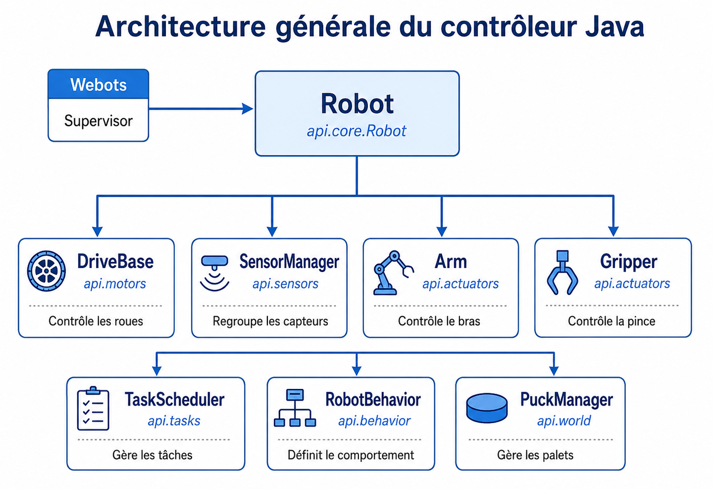
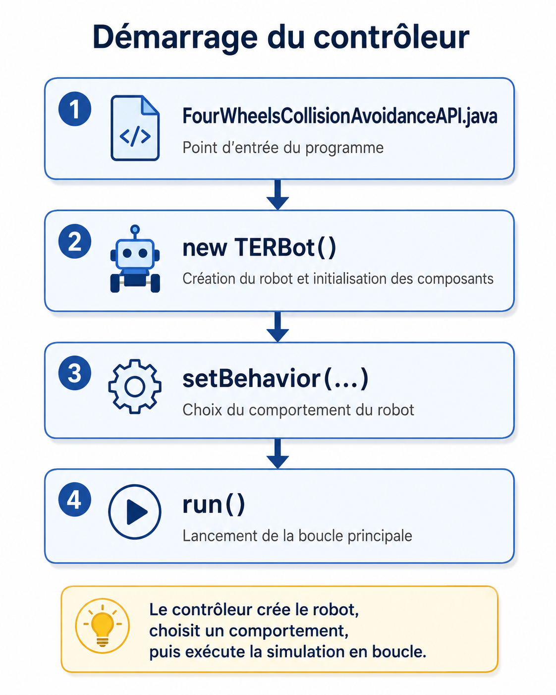
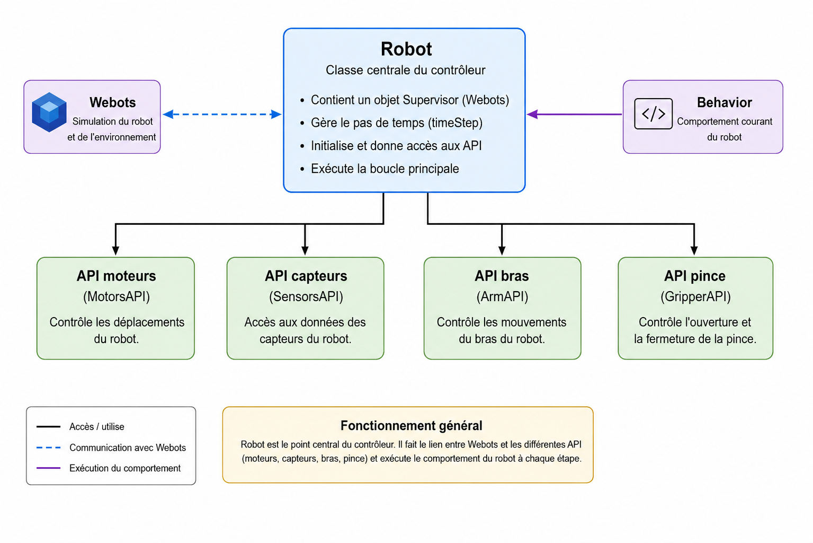
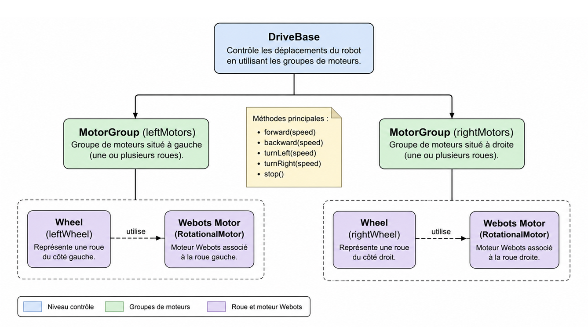
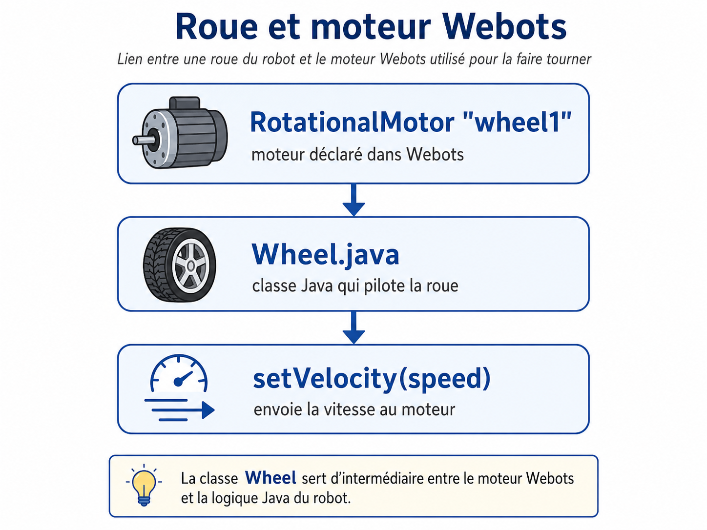
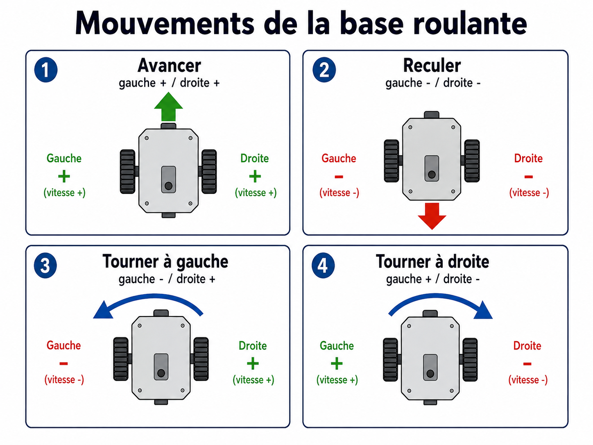
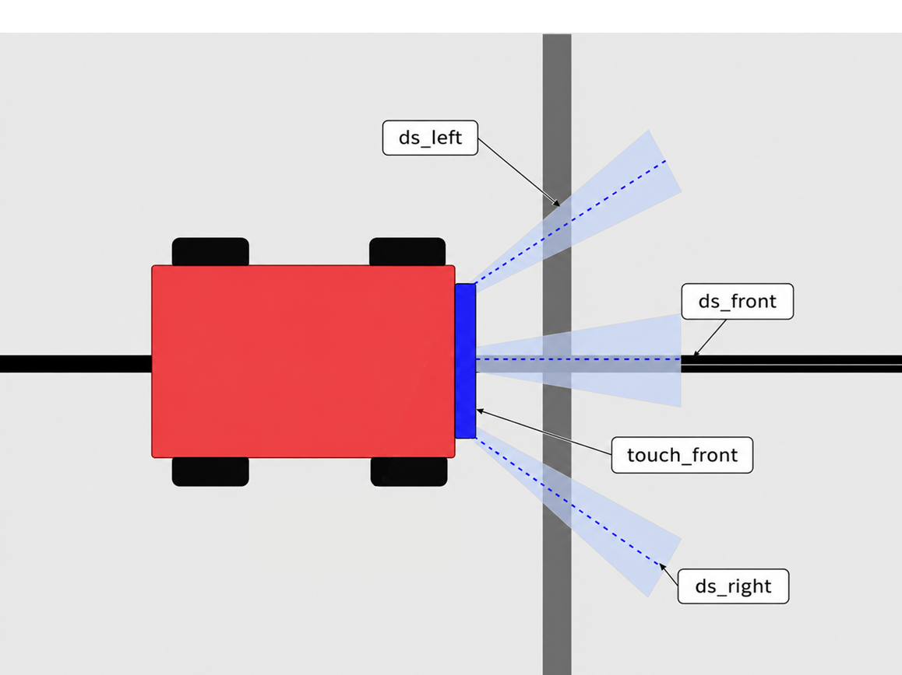
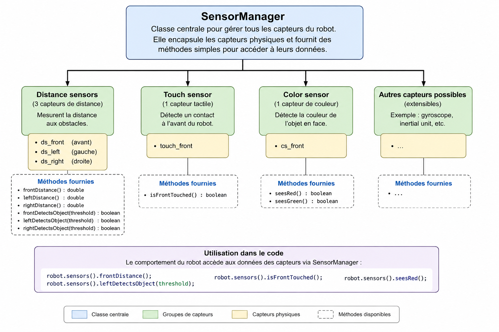

# TP2 — API du contrôleur Java

## Projet robotique sur Webots

---

## Sommaire

- [0. Informations et objectifs](#0-informations-et-objectifs)
  - [0.1 Contexte du TP](#01-contexte-du-tp)
  - [0.2 Matériel et outils nécessaires](#02-matériel-et-outils-nécessaires)
  - [0.3 Objectifs de la séance](#03-objectifs-de-la-séance)
- [1. Organisation du contrôleur](#1-organisation-du-contrôleur)
  - [1.1 Conception du contrôleur](#11-conception-du-contrôleur)
  - [1.2 Organisation des fichiers](#12-organisation-des-fichiers)
  - [1.3 Point d’entrée du contrôleur](#13-point-dentrée-du-contrôleur)
  - [1.4 Rôle de la classe Robot](#14-rôle-de-la-classe-robot)
  - [1.5 Travail à réaliser](#15-travail-à-réaliser)
- [2. Complétion de l’API moteurs](#2-complétion-de-lapi-moteurs)
- [3. Complétion de l’API capteurs](#3-complétion-de-lapi-capteurs)
- [4. Complétion des APIs du bras et de la pince](#4-complétion-des-apis-du-bras-et-de-la-pince)
- [5. Comportement du robot](#5-comportement-du-robot)
- [6. Test et validation](#6-test-et-validation)
- [7. Bilan du TP](#7-bilan-du-tp)

---

# 0. Informations et objectifs

## 0.1 Contexte du TP

Dans le **TP1**, vous avez finalisé la structure du robot directement dans Webots.

Vous avez notamment ajouté :

- les roues
- les capteurs
- le bras
- la pince
- un contrôleur de validation

Dans ce **TP2**, vous allez travailler davantage sur le **code Java du contrôleur**.

L’objectif n’est pas encore de programmer la récupération complète des palets.  
Le comportement de collecte sera étudié dans les TP suivants.

Dans ce TP, vous allez compléter une API permettant de :

- commander les roues
- lire les capteurs
- manipuler le bras
- manipuler la pince
- lancer un comportement simple d’évitement d’obstacles

---

## 0.2 Matériel et outils nécessaires

Pour réaliser ce TP, vous devez disposer des éléments suivants :

| Élément | Utilisation |
|---|---|
| Un ordinateur | Exécuter Webots et modifier le code |
| Webots | Simuler le robot |
| Visual Studio Code | Modifier plus facilement les fichiers Java |
| Documentation Webots | Comprendre les classes et objets Webots |
| Documentation Java | Comprendre la syntaxe et les classes Java |

Liens utiles :

- [Site officiel de Webots](https://www.cyberbotics.com/)
- [Documentation Webots](https://cyberbotics.com/doc/reference/index)
- [Visual Studio Code](https://code.visualstudio.com/)
- [Documentation Java](https://docs.oracle.com/en/java/)

---

## 0.3 Objectifs de la séance

À la fin de ce TP, vous devez être capables de :

- comprendre l’organisation générale du contrôleur Java
- compléter des fonctions simples dans les classes de l’API
- commander les roues du robot avec des méthodes réutilisables
- lire les valeurs des capteurs de distance
- commander le bras et la pince
- lancer un comportement simple d’évitement d’obstacles

---

# 1. Organisation du contrôleur

## 1.1 Conception du contrôleur

Pour faciliter la compréhension et l’évolution du projet, le contrôleur du robot a été divisé en plusieurs classes formant une petite API.

Cette API permet d’utiliser le robot plus simplement, sans manipuler directement tous les moteurs et capteurs dans le programme principal.

Chaque partie de l’API possède un rôle précis :

| Partie de l’API | Rôle |
|---|---|
| `api.motors` | Gérer les roues et les déplacements |
| `api.sensors` | Lire les capteurs |
| `api.actuators` | Commander le bras et la pince |
| `api.behavior` | Définir le comportement du robot |
| `api.core` | Regrouper les différentes parties du robot |
| `api.tasks` | Gérer des actions dans le temps |
| `api.utils` | Fournir des fonctions utilitaires |



*Figure 1 — Architecture générale du contrôleur Java autour des différentes parties de l’API.*

Cette organisation rend le code :

- plus lisible
- plus simple à modifier
- plus facile à réutiliser dans les TP suivants

Par exemple, au lieu de contrôler chaque roue séparément, on pourra simplement écrire :

```java
robot.motors().forward(4.0);
```

au lieu de manipuler directement les quatre moteurs Webots.

---

## 1.2 Organisation des fichiers

Le contrôleur Webots utilisé dans ce projet s’appelle :

```text
FourWheelsCollisionAvoidanceAPI
```

Ce nom doit correspondre au nom indiqué dans le champ `controller` du robot dans Webots.

L’organisation du contrôleur est la suivante :

```text
controllers/
└── FourWheelsCollisionAvoidanceAPI/
    ├── FourWheelsCollisionAvoidanceAPI.java
    └── api/
        ├── actuators/
        │   ├── Arm.java
        │   └── Gripper.java
        ├── behavior/
        │   ├── RobotBehavior.java
        │   └── SimpleAvoidObstacleBehavior.java
        ├── core/
        │   └── Robot.java
        ├── motors/
        │   ├── Wheel.java
        │   ├── MotorGroup.java
        │   └── DriveBase.java
        ├── sensors/
        │   ├── DistanceSensorWrapper.java
        │   ├── SensorManager.java
        │   └── TouchSensorWrapper.java
        ├── tasks/
        │   ├── RobotTask.java
        │   ├── TaskScheduler.java
        │   └── TimedTask.java
        └── utils/
            └── MathUtils.java
```

---

## 1.3 Point d’entrée du contrôleur

Le fichier suivant est le point d’entrée du contrôleur :

```text
FourWheelsCollisionAvoidanceAPI.java
```

C’est le premier fichier exécuté par Webots lorsque la simulation démarre.

Son rôle est de :

1. créer le robot
2. lui associer un comportement
3. lancer son exécution

Exemple :

```java
Robot robot = new Robot();
robot.setBehavior(new SimpleAvoidObstacleBehavior(robot));
robot.run();
```

Dans ce TP, le comportement utilisé est un comportement simple d’évitement d’obstacles.

 

*Figure 2 — Démarrage du contrôleur : création du robot, choix du comportement et lancement de la boucle principale.*

---

## 1.4 Rôle de la classe Robot

La classe `Robot` représente le cœur du contrôleur.

Elle fait le lien entre :

- Webots
- les moteurs
- les capteurs
- le bras
- la pince
- le comportement du robot

Lors de sa création, `Robot` crée un objet `Supervisor`.

```java
this.supervisor = new Supervisor();
```

Le `Supervisor` est un objet Webots qui permet au contrôleur de communiquer avec la simulation.

Il permet notamment de récupérer :

- les moteurs
- les capteurs
- le pas de temps de la simulation
- certaines informations sur le monde

La classe `Robot` récupère ensuite le `timeStep`, qui correspond au pas de temps utilisé par Webots.

```java
this.timeStep = (int) Math.round(supervisor.getBasicTimeStep());
```

Elle initialise ensuite les différentes parties de l’API :

```java
this.driveBase = new DriveBase(supervisor);
this.sensorManager = new SensorManager(supervisor, timeStep);
this.arm = new Arm(supervisor, timeStep);
this.gripper = new Gripper(supervisor);
this.scheduler = new TaskScheduler();
```

La méthode `run()` lance ensuite la boucle principale du robot :

```java
while (supervisor.step(timeStep) != -1) {
  scheduler.update();

  if (behavior != null) {
    behavior.update();
  }
}
```

À chaque passage dans la boucle :

1. Webots avance la simulation
2. le scheduler est mis à jour
3. le comportement du robot est exécuté

C’est donc dans la méthode `update()` du comportement que seront prises les décisions du robot.



*Figure 3 — Rôle de la classe Robot comme point central entre Webots, les capteurs, les moteurs et les comportements.*

---

## 1.5 Travail à réaliser

Dans ce TP, vous devez compléter certaines parties de l’API du robot.

Vous ne devez pas réécrire tout le contrôleur.  
Une grande partie du projet est déjà fournie afin de conserver une structure propre et fonctionnelle.

Votre objectif est de compléter les méthodes manquantes dans les fichiers indiqués, puis de vérifier que le comportement simple du robot fonctionne correctement.

| Fichier | Rôle | Action |
|---|---|---|
| `FourWheelsCollisionAvoidanceAPI.java` | Point d’entrée du contrôleur Webots | À lire |
| `Robot.java` | Classe principale qui regroupe les API | À lire |
| `api/motors/Wheel.java` | Commande d’une roue | À compléter |
| `api/motors/MotorGroup.java` | Commande d’un groupe de roues | À compléter |
| `api/motors/DriveBase.java` | Déplacements du robot | À compléter |
| `api/sensors/DistanceSensorWrapper.java` | Lecture d’un capteur de distance | À compléter |
| `api/sensors/SensorManager.java` | Regroupe les capteurs du robot | À compléter |
| `api/actuators/Arm.java` | Commande du bras | À compléter |
| `api/actuators/Gripper.java` | Commande de la pince | À compléter |
| `api/behavior/SimpleAvoidObstacleBehavior.java` | Comportement simple du TP2 | À lire |

---

# 2. Complétion de l’API moteurs

L’API moteurs permet de simplifier le contrôle des roues du robot.

Elle est composée de trois classes principales :

- `Wheel`
- `MotorGroup`
- `DriveBase`

 

*Figure 4 — Organisation de l’API moteurs avec les classes Wheel, MotorGroup et DriveBase.*

---

## 2.1 Classe Wheel

La classe `Wheel` représente une roue du robot.

Elle encapsule un moteur Webots de type `Motor` et fournit des méthodes simples :

- `setSpeed`
- `forward`
- `backward`
- `stop`



*Figure 5 — Lien entre une roue du robot et le moteur Webots utilisé pour la faire tourner.*

### Rôle de la classe

Au lieu de manipuler directement un moteur Webots, on utilise une classe plus simple.

Exemple attendu :

```java
wheel.forward(4.0);
wheel.stop();
```

### Travail à faire

#### TODO 1.1 — Configurer le moteur en rotation continue

Dans le constructeur, le moteur doit être configuré en rotation continue avec :

```java
motor.setPosition(Double.POSITIVE_INFINITY);
```

Il faut également initialiser sa vitesse à `0.0`.

---

#### TODO 1.2 — Appliquer une vitesse au moteur

La méthode `setSpeed(double speed)` doit :

1. mémoriser la vitesse courante
2. appliquer cette vitesse au moteur Webots

---

#### TODO 1.3 — Avancer

La méthode `forward(double speed)` doit faire avancer la roue avec une vitesse positive.

---

#### TODO 1.4 — Reculer

La méthode `backward(double speed)` doit faire reculer la roue avec une vitesse négative.

---

#### TODO 1.5 — Arrêter la roue

La méthode `stop()` doit arrêter la roue.

---

## 2.2 Classe MotorGroup

La classe `MotorGroup` permet d’appliquer la même commande à plusieurs roues.

Elle sera utilisée pour regrouper :

- les roues gauches
- les roues droites

### Exemple

```java
MotorGroup leftWheels = new MotorGroup(frontLeft, rearLeft);
leftWheels.forward(4.0);
```

### Travail à faire

#### TODO 2.1 — Parcourir les roues

Vous devez parcourir le tableau `wheels`.

---

#### TODO 2.2 — Vérifier que chaque roue existe

Avant d’utiliser une roue, il faut vérifier qu’elle n’est pas `null`.

---

#### TODO 2.3 — Appliquer une vitesse

La méthode `setSpeed(double speed)` doit appliquer la vitesse à toutes les roues du groupe.

---

#### TODO 2.4 — Compléter les méthodes de déplacement

Les méthodes suivantes doivent utiliser `setSpeed` :

```java
forward(double speed)
backward(double speed)
stop()
```

---

## 2.3 Classe DriveBase

La classe `DriveBase` correspond à la base roulante du robot.

Elle regroupe les quatre roues et fournit des méthodes de déplacement plus lisibles.

### Roues utilisées

| Roue | Nom du moteur Webots |
|---|---|
| Avant gauche | `wheel1` |
| Avant droite | `wheel2` |
| Arrière gauche | `wheel3` |
| Arrière droite | `wheel4` |

### Groupes de roues

```java
leftWheels = new MotorGroup(frontLeft, rearLeft);
rightWheels = new MotorGroup(frontRight, rearRight);
```

### Travail à faire

| TODO | Méthode | Comportement attendu |
|---|---|---|
| 3.1 | `setSpeed(leftSpeed, rightSpeed)` | Appliquer une vitesse au côté gauche et au côté droit |
| 3.2 | `forward(speed)` | Les deux côtés avancent |
| 3.3 | `backward(speed)` | Les deux côtés reculent |
| 3.4 | `turnLeft(speed)` | Côté gauche en arrière, côté droit en avant |
| 3.5 | `turnRight(speed)` | Côté gauche en avant, côté droit en arrière |
| 3.6 | `curveLeft(speed, factor)` | Le robot avance en courbe vers la gauche |
| 3.7 | `curveRight(speed, factor)` | Le robot avance en courbe vers la droite |
| 3.8 | `stop()` | Toutes les roues sont arrêtées |

 

*Figure 6 — Effet des vitesses des roues sur les déplacements du robot.*

---

# 3. Complétion de l’API capteurs

L’API capteurs permet de lire plus facilement les valeurs des capteurs Webots.

Dans ce TP, vous allez utiliser principalement les capteurs de distance.



*Figure 7 — Position des capteurs utilisés par l’API capteurs du robot.*

---

## 3.1 Classe DistanceSensorWrapper

La classe `DistanceSensorWrapper` encapsule un capteur de distance Webots.

Elle permet de :

- l’activer
- lire sa valeur
- vérifier s’il détecte un objet selon un seuil

### Travail à faire

#### TODO 4.1 — Activer le capteur

Dans le constructeur, le capteur doit être activé avec :

```java
sensor.enable(timeStep);
```

---

#### TODO 4.2 — Retourner la valeur du capteur

La méthode `getValue()` doit retourner la valeur actuelle du capteur.

---

#### TODO 4.3 — Détecter un objet

La méthode `detectsObject(double threshold)` doit retourner `true` si la valeur du capteur est supérieure au seuil donné.

Exemple :

```java
if (frontSensor.detectsObject(350.0)) {
  // obstacle détecté
}
```

---

## 3.2 Classe SensorManager

La classe `SensorManager` centralise l’accès aux capteurs du robot.

Elle évite de récupérer les capteurs directement dans le comportement.



*Figure 8 — SensorManager regroupe les capteurs du robot et fournit des méthodes simples pour les utiliser.*

### Capteurs utilisés

| Capteur | Nom Webots |
|---|---|
| Capteur droit | `ds_right` |
| Capteur gauche | `ds_left` |
| Capteur frontal | `ds_front` |
| Capteur de contact | `touch_front` |
| Caméra couleur | `color_sensor` |

### Travail à faire

Vous devez initialiser les capteurs avec les bons noms Webots.

Exemple :

```java
robot.getDistanceSensor("ds_front");
```

La classe doit ensuite proposer des méthodes simples comme :

```java
frontDistance()
leftDistance()
rightDistance()
frontDetectsObject(threshold)
leftDetectsObject(threshold)
rightDetectsObject(threshold)
```

---

# 4. Complétion des APIs du bras et de la pince

Cette partie permet de commander les éléments mécaniques du robot.

---

## 4.1 Classe Arm

La classe `Arm` permet de lever ou baisser le bras du robot.

Le moteur du bras utilise une position cible.

### Moteurs et capteurs utilisés

| Élément | Nom Webots |
|---|---|
| Moteur du bras | `arm_motor` |
| Capteur de position | `arm_sensor` |

### Positions utilisées

```java
private double upPosition = -0.65;
private double downPosition = 0.35;
```

### Travail à faire

| TODO | Méthode | Action attendue |
|---|---|---|
| 6.1 | `lift()` | Déplacer le bras vers `upPosition` |
| 6.2 | `lower()` | Déplacer le bras vers `downPosition` |
| 6.3 | `moveTo(position)` | Envoyer une position au moteur `arm_motor` |
| 6.4 | `getPosition()` | Lire la position avec `arm_sensor` |

---

## 4.2 Classe Gripper

La classe `Gripper` permet d’ouvrir et de fermer la pince.

Elle commande deux moteurs :

| Élément | Nom Webots |
|---|---|
| Moteur gauche | `gripper_left_motor` |
| Moteur droit | `gripper_right_motor` |

### Positions utilisées

```java
private double openLeftPosition = 0.2;
private double openRightPosition = -0.2;

private double closedLeftPosition = -0.55;
private double closedRightPosition = 0.55;
```

### Travail à faire

| TODO | Méthode | Action attendue |
|---|---|---|
| 7.1 | `open()` | Ouvrir la pince |
| 7.2 | `close()` | Fermer la pince |

---

# 5. Comportement du robot

Dans ce TP, le comportement du robot est déjà fourni.

Vous n’avez pas besoin de le compléter, mais vous devez le lire afin de comprendre comment les différentes parties de l’API sont utilisées ensemble.

Le comportement utilisé est :

```text
SimpleAvoidObstacleBehavior
```

Il s’agit d’un comportement simple d’évitement d’obstacles.

## Principe du comportement

Le robot :

1. lit les valeurs des capteurs
2. vérifie si un obstacle est détecté
3. avance si aucun obstacle n’est présent
4. tourne si un obstacle est détecté

Exemple simplifié :

```java
if (robot.sensors().frontDetectsObject(FRONT_THRESHOLD)) {
  robot.motors().turnLeft(TURN_SPEED);
} else {
  robot.motors().forward(SPEED);
}
```

Ce comportement montre le lien entre :

- les capteurs
- les moteurs
- la logique de décision

---

# 6. Test et validation

## 6.1 Lancer la simulation

Lancez la simulation dans Webots avec le contrôleur :

```text
FourWheelsCollisionAvoidanceAPI
```

Le robot doit :

- lever le bras
- ouvrir la pince
- avancer lorsqu’il n’y a pas d’obstacle
- tourner lorsqu’un obstacle est détecté

---

## 6.2 Critères de validation

Votre travail est validé si :

- le projet compile sans erreur
- le robot avance lorsque rien n’est détecté
- le robot tourne si le capteur frontal détecte un obstacle
- le robot tourne du côté opposé si un capteur latéral détecte un obstacle
- la pince s’ouvre au lancement du comportement
- le bras se lève au lancement du comportement

---

## 6.3 Commande de compilation

Depuis le dossier du contrôleur, vous pouvez recompiler avec :

```bash
./controller.bat rebuild
```

Sous Windows PowerShell :

```powershell
.\controller.bat rebuild
```

Après compilation, pensez à faire un **Reset Simulation** dans Webots.

---

# 7. Bilan du TP

Dans ce TP, vous avez commencé à travailler sur le contrôleur Java du robot.

L’objectif principal était de comprendre l’organisation du code et de compléter une API simple permettant de piloter les différentes parties du robot.

Vous avez vu que le contrôleur est divisé en plusieurs classes afin de rendre le code plus clair et plus facile à réutiliser.

Cette API permet de commander le robot avec des méthodes simples, par exemple pour :

- faire avancer les roues
- lire les capteurs
- lever le bras
- ouvrir la pince

Vous avez également compris le rôle de la classe `Robot`, qui sert de lien entre Webots, les différentes API du robot et le comportement à exécuter.

Dans ce TP, vous avez complété plusieurs parties importantes :

- l’API moteurs, avec `Wheel`, `MotorGroup` et `DriveBase`
- l’API capteurs, avec `DistanceSensorWrapper` et `SensorManager`
- l’API du bras et de la pince, avec `Arm` et `Gripper`

Le comportement utilisé, `SimpleAvoidObstacleBehavior`, était déjà fourni.  
Il permet de montrer comment les API sont utilisées ensemble : le robot lit ses capteurs, décide s’il y a un obstacle, puis commande ses moteurs pour avancer ou tourner.

---

## Compétences travaillées

À la fin de ce TP, vous devez être capables de :

- expliquer le rôle général d’une API dans le contrôleur
- identifier les principales classes du contrôleur
- comprendre le lien entre `FourWheelsCollisionAvoidanceAPI`, `Robot` et le comportement du robot
- compléter des méthodes simples pour commander les moteurs
- lire les valeurs des capteurs
- commander le bras et la pince
- tester un comportement simple d’évitement d’obstacles

---

## Pour la suite

Ce TP servira de base pour les prochains travaux pratiques.

Les fonctions complétées ici seront réutilisées pour créer des comportements plus complexes, notamment :

- la détection des palets
- l’approche d’un palet
- la prise d’un palet
- le transport
- le dépôt dans une zone définie