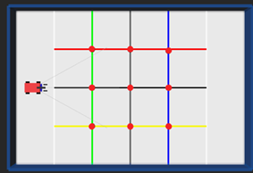
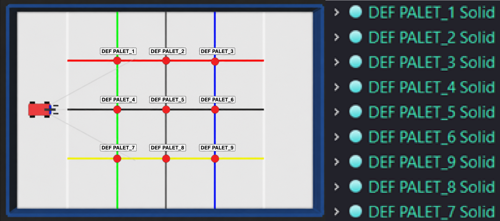
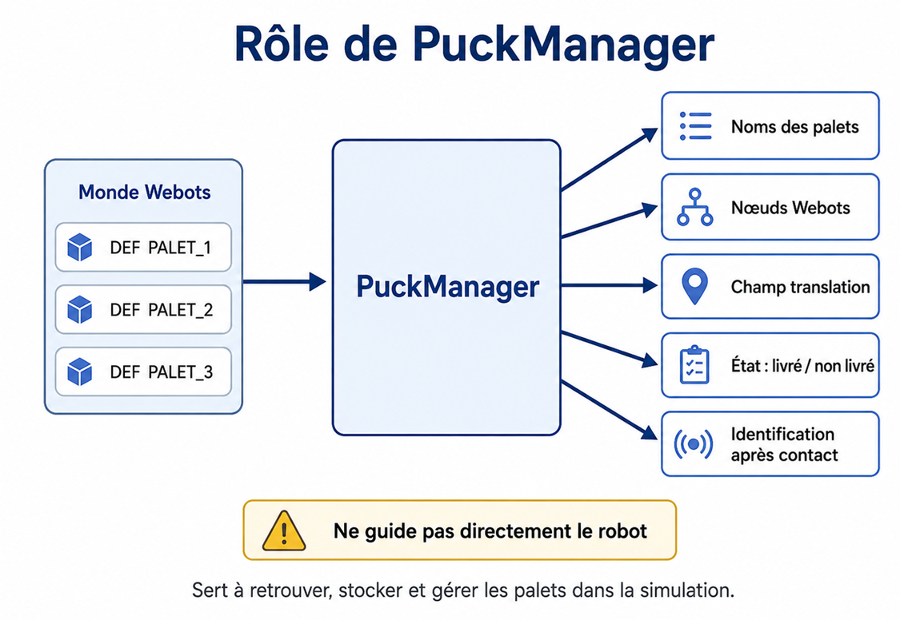
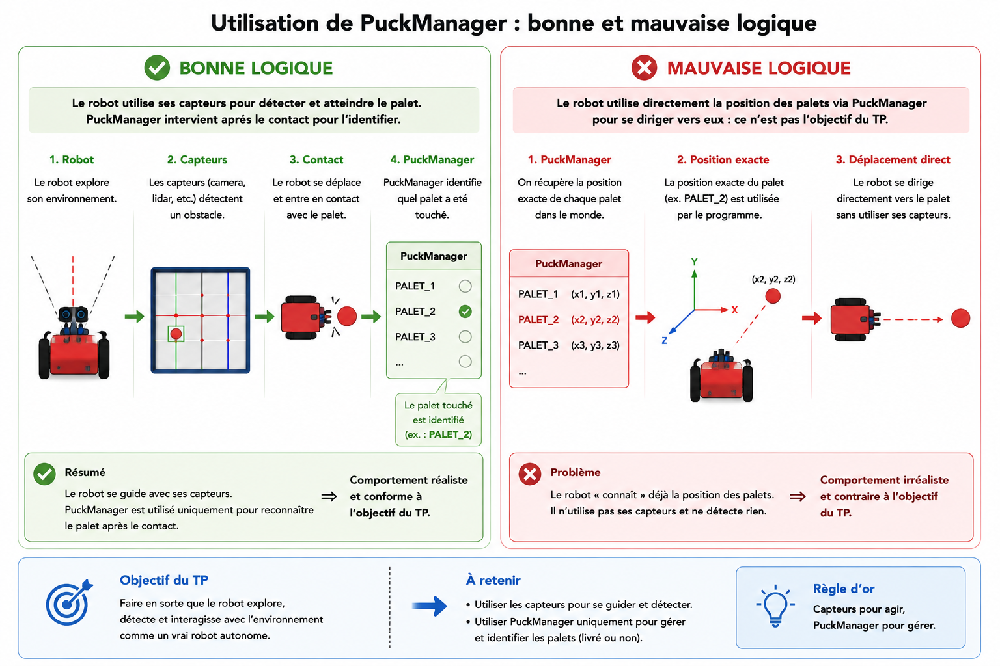
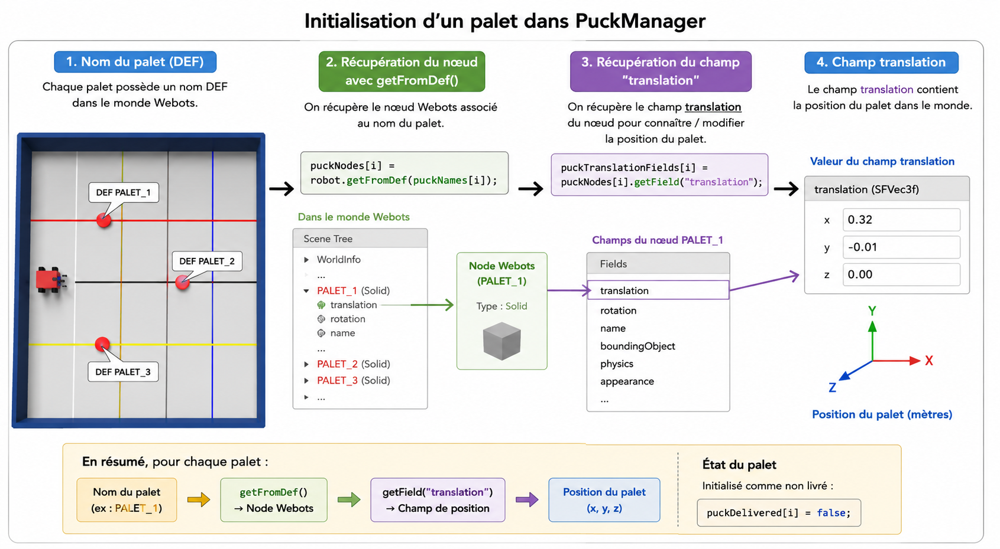
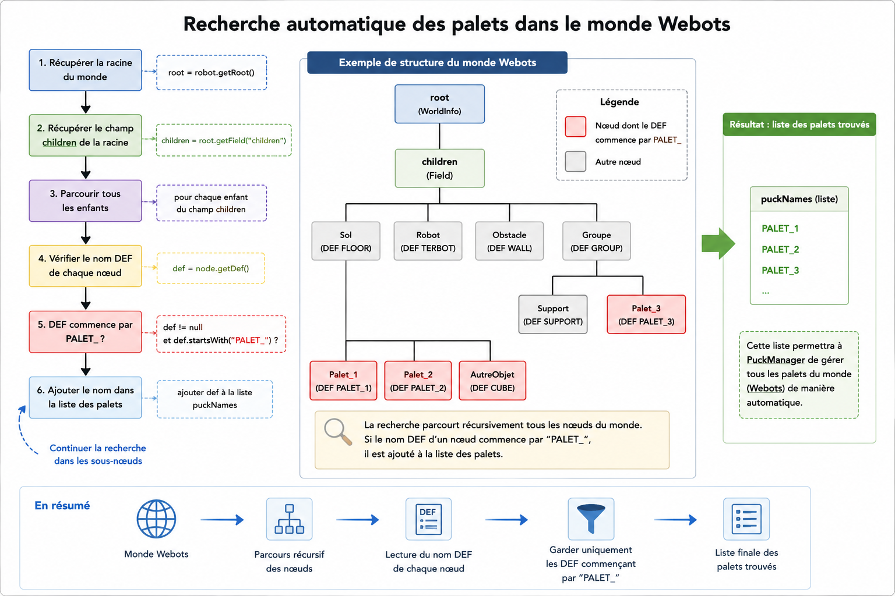
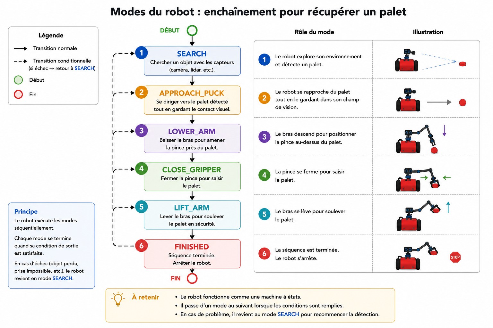
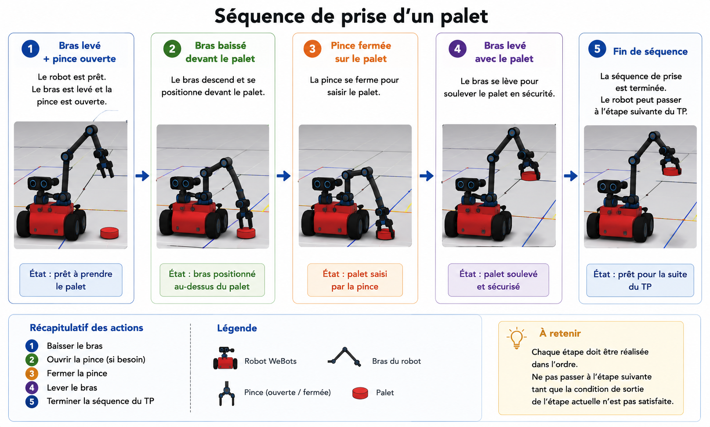

# TP3 — Gestion des palets et première logique de récupération

## Projet robotique sur Webots

---

## Sommaire

- [0. Informations et objectifs](#0-informations-et-objectifs)
  - [0.1 Contexte du TP](#01-contexte-du-tp)
  - [0.2 Matériel et outils nécessaires](#02-matériel-et-outils-nécessaires)
  - [0.3 Objectifs de la séance](#03-objectifs-de-la-séance)
- [1. Organisation du code](#1-organisation-du-code)
  - [1.1 Organisation des fichiers](#11-organisation-des-fichiers)
  - [1.2 Fichiers à lire et à compléter](#12-fichiers-à-lire-et-à-compléter)
- [2. Comprendre les palets dans Webots](#2-comprendre-les-palets-dans-webots)
  - [2.1 Les noms des palets](#21-les-noms-des-palets)
  - [2.2 Rôle de PuckManager](#22-rôle-de-puckmanager)
- [3. Complétion de PuckManager](#3-complétion-de-puckmanager)
  - [3.1 Initialisation des palets](#31-initialisation-des-palets)
  - [3.2 Recherche automatique des palets](#32-recherche-automatique-des-palets)
  - [3.3 Accès aux informations d’un palet](#33-accès-aux-informations-dun-palet)
  - [3.4 Identification d’un palet après contact](#34-identification-dun-palet-après-contact)
- [4. Modes du robot](#4-modes-du-robot)
- [5. Première récupération d’un palet](#5-première-récupération-dun-palet)
  - [5.1 Recherche de palet](#51-recherche-de-palet)
  - [5.2 Approche du palet](#52-approche-du-palet)
  - [5.3 Séquence de prise](#53-séquence-de-prise)
- [6. Test et validation](#6-test-et-validation)
- [7. Bilan du TP](#7-bilan-du-tp)

---

# 0. Informations et objectifs

## 0.1 Contexte du TP

Dans le **TP1**, vous avez finalisé la structure du robot directement dans Webots.

Dans le **TP2**, vous avez complété une première API permettant de commander :

- les roues
- les capteurs
- le bras
- la pince.

Dans ce **TP3**, vous allez commencer à travailler autour des **palets**.



*Figure 1 — Vue globale du TP3 avec le robot et les palets dans Webots.*

L’objectif est de comprendre comment les palets sont représentés dans le monde Webots, comment ils peuvent être retrouvés par le contrôleur, et comment le robot peut lancer une première séquence de récupération.

Ce TP introduit une nouvelle partie importante du projet : la gestion des objets présents dans le monde Webots.

Cependant, il faut bien distinguer deux notions :

| Élément | Rôle |
|---|---|
| Les capteurs du robot | Détecter les objets dans l’environnement |
| `PuckManager` | Gérer les palets présents dans Webots |

Dans ce TP, le robot ne doit pas utiliser directement la position exacte des palets pour se guider.  
Il doit principalement utiliser ses capteurs pour détecter les objets autour de lui.

`PuckManager` sert surtout à gérer les palets dans la simulation et à identifier un palet après un contact.

---

## 0.2 Matériel et outils nécessaires

Pour réaliser ce TP, vous devez disposer des éléments suivants :

| Élément | Utilisation |
|---|---|
| Un ordinateur | Exécuter Webots et modifier le code |
| Webots | Simuler le robot et les palets |
| Visual Studio Code | Modifier plus facilement les fichiers Java |
| Documentation Webots | Comprendre les objets Webots comme `Supervisor`, `Node` et `Field` |
| Documentation Java | Comprendre la syntaxe Java et les tableaux |

Liens utiles :

- [Site officiel de Webots](https://www.cyberbotics.com/)
- [Documentation Webots](https://cyberbotics.com/doc/reference/index)
- [Visual Studio Code](https://code.visualstudio.com/)
- [Documentation Java](https://docs.oracle.com/en/java/)

---

## 0.3 Objectifs de la séance

À la fin de ce TP, vous devez être capables de :

- comprendre le rôle des palets dans le monde Webots
- comprendre le rôle des noms `DEF`
- comprendre l’intérêt du préfixe `PALET_`
- compléter la classe `PuckManager`
- récupérer un palet dans le monde Webots
- accéder aux informations d’un palet
- comprendre pourquoi le robot ne doit pas utiliser directement la position exacte des palets
- utiliser les capteurs pour détecter un objet
- comprendre les premiers modes du robot
- lire et compléter une première partie du comportement de récupération

---

# 1. Organisation du code

## 1.1 Organisation des fichiers

Le TP3 reprend la structure du contrôleur utilisée dans le TP2.

Une nouvelle partie importante apparaît :

```text
api/world/
```

Ce dossier contient la classe permettant de gérer les palets présents dans le monde Webots.

L’organisation du contrôleur est la suivante :

```text
controllers/
└── FourWheelsCollisionAvoidanceAPI/
    ├── FourWheelsCollisionAvoidanceAPI.java
    └── api/
        ├── actuators/
        │   ├── Arm.java
        │   └── Gripper.java
        ├── behavior/
        │   ├── RobotBehavior.java
        │   ├── SimpleAvoidObstacleBehavior.java
        │   └── CollectPucksBehavior.java
        ├── core/
        │   └── TERBot.java
        ├── motors/
        │   ├── Wheel.java
        │   ├── MotorGroup.java
        │   └── DriveBase.java
        ├── sensors/
        │   ├── DistanceSensorWrapper.java
        │   ├── SensorManager.java
        │   └── TouchSensorWrapper.java
        ├── state/
        │   └── RobotMode.java
        ├── tasks/
        │   ├── RobotTask.java
        │   ├── TaskScheduler.java
        │   └── TimedTask.java
        ├── utils/
        │   └── MathUtils.java
        └── world/
            └── PuckManager.java
```

---

## 1.2 Fichiers à lire et à compléter

| Fichier | Rôle | Action |
|---|---|---|
| `FourWheelsCollisionAvoidanceAPI.java` | Point d’entrée du contrôleur | À lire |
| `TERBot.java` | Classe principale qui regroupe les API | À lire |
| `PuckManager.java` | Gestion des palets dans le monde Webots | À compléter |
| `RobotMode.java` | Énumération des modes du robot | À compléter ou vérifier |
| `CollectPucksBehavior.java` | Première logique de récupération d’un palet | À compléter partiellement |
| `api/motors` | API moteurs complétée au TP2 | À réutiliser |
| `api/sensors` | API capteurs complétée au TP2 | À réutiliser |
| `api/actuators` | API bras et pince complétée au TP2 | À réutiliser |

---

# 2. Comprendre les palets dans Webots

## 2.1 Les noms des palets

Dans le monde Webots, les palets sont des objets de type `Solid`.

Chaque palet possède un nom `DEF`.  
Ce nom permet au contrôleur de retrouver l’objet dans le monde Webots.

Exemple :

```webots
DEF PALET_1 Solid {
  ...
}

DEF PALET_2 Solid {
  ...
}

DEF PALET_3 Solid {
  ...
}
```



*Figure 2 — Exemple de palets nommés avec le préfixe PALET_ dans Webots.*

Dans ce TP, tous les palets doivent suivre la même convention de nommage :

```text
PALET_
```

Exemples valides :

```text
PALET_1
PALET_2
PALET_3
PALET_4
```

Le préfixe `PALET_` est important, car la classe `PuckManager` va parcourir le monde Webots et récupérer automatiquement tous les objets dont le nom `DEF` commence par ce préfixe.

---

## 2.2 Rôle de PuckManager

La classe `PuckManager` centralise les informations sur les palets.

Elle permet de stocker :

- les noms des palets
- les nœuds Webots associés
- leur champ `translation`
- leur état.

Elle permet notamment de :

- connaître le nombre de palets présents dans le monde
- récupérer un palet à partir de son indice
- connaître le nom d’un palet
- savoir si un palet est déjà livré
- identifier un palet proche de la zone de contact du robot
- préparer plus tard l’attachement et le dépôt d’un palet



*Figure 3 — Rôle de PuckManager dans la gestion des palets du monde Webots.*

---

## Attention importante

`PuckManager` ne doit pas servir à guider directement le robot vers un palet.

Il ne faut pas utiliser `PuckManager` pour faire une logique comme :

```text
Le robot connaît la position exacte de PALET_3.
Il calcule l’angle vers PALET_3.
Il se dirige directement vers PALET_3.
```



*Figure 4 — Différence entre une détection par capteurs et une utilisation directe de la position des palets.*

Cette solution fonctionne dans une simulation, mais elle n’est pas réaliste pour un robot autonome.  
Dans un vrai comportement autonome, le robot doit utiliser ses capteurs pour détecter ce qui se trouve autour de lui.

La bonne logique est plutôt :

```text
Le robot avance.
Il détecte un objet avec ses capteurs.
Il s’oriente vers l’objet détecté.
Il confirme le contact avec le TouchSensor.
PuckManager vérifie ensuite si l’objet touché correspond à un palet connu.
```

---

# 3. Complétion de PuckManager

Dans cette partie, vous devez compléter les `TODO` présents dans le fichier :

```text
api/world/PuckManager.java
```

La classe utilise l’objet `Supervisor` de Webots pour accéder :

- au monde
- aux nœuds
- aux champs des palets

---

## 3.1 Initialisation des palets

Dans le constructeur de `PuckManager`, vous devez associer chaque nom de palet à son nœud Webots.

Pour cela, utilisez le nom `DEF` du palet.

Exemple :

```java
puckNodes[i] = robot.getFromDef(puckNames[i]);
```


*Figure 5 — Initialisation d’un palet dans PuckManager à partir de son nom DEF.*

Ensuite, si le nœud existe, vous devez récupérer son champ `translation`.

```java
puckTranslationFields[i] = puckNodes[i].getField("translation");
```

Le champ `translation` permet de connaître ou modifier la position du palet dans le monde.

Vous devez également initialiser l’état du palet à `false`, car au début de la simulation, le palet n’est pas encore livré.

```java
puckDelivered[i] = false;
```

### Travail attendu

Pour chaque palet :

1. récupérer le nœud Webots avec `getFromDef`
2. récupérer le champ `translation`
3. initialiser le palet comme non livré
4. afficher un message d’avertissement si le palet n’est pas trouvé

---

## 3.2 Recherche automatique des palets

La méthode `findAllWithPrefix` doit retrouver automatiquement les palets présents dans le monde Webots.

Elle doit chercher tous les objets dont le nom `DEF` commence par :

```text
PALET_
```

Cette méthode s’appuie sur une fonction récursive :

```java
collectDefNamesWithPrefix(...)
```

### Principe

La recherche doit :

1. récupérer la racine du monde
2. récupérer le champ `children` de la racine
3. parcourir tous les enfants
4. vérifier le nom `DEF` de chaque nœud
5. ajouter les noms commençant par `PALET_`
6. continuer la recherche dans les sous-nœuds



*Figure 6 — Recherche automatique des palets dans le monde Webots grâce au préfixe PALET_.*

### Exemple de récupération de la racine

```java
Node root = robot.getRoot();
Field childrenField = root.getField("children");
```

### Exemple de parcours

```java
for (int i = 0; i < childrenField.getCount(); i++) {
  Node child = childrenField.getMFNode(i);
  collectDefNamesWithPrefix(child, prefix, names);
}
```

Cette recherche automatique permet d’éviter d’écrire manuellement la liste des palets dans le code.

---

## 3.3 Accès aux informations d’un palet

Vous devez compléter les méthodes permettant de récupérer les informations d’un palet.

Ces méthodes sont utilisées pour suivre les palets dans la simulation.

Elles permettent notamment de récupérer :

- le nœud Webots du palet
- le nom du palet
- la position du palet
- l’état du palet

### Vérification des indices

Avant d’accéder à un tableau, il faut toujours vérifier que l’indice est valide.

Exemple :

```java
if (index < 0 || index >= puckNodes.length) {
  return null;
}
```

Cette vérification évite les erreurs de type :

```text
ArrayIndexOutOfBoundsException
```

### Méthodes concernées

| Méthode | Rôle attendu |
|---|---|
| `count()` | Retourner le nombre de palets chargés |
| `getPuckNode(index)` | Retourner le nœud Webots du palet |
| `getPuckPosition(index)` | Retourner la position du palet |
| `getPuckName(index)` | Retourner le nom du palet |
| `isDelivered(index)` | Indiquer si le palet est déjà livré |

---

## 3.4 Identification d’un palet après contact

Dans ce TP, il est important de faire la différence entre deux choses :

| Élément | Rôle |
|---|---|
| Les capteurs du robot | Détecter les objets dans l’environnement |
| `PuckManager` | Gérer les palets présents dans le monde Webots |

Le robot ne doit pas utiliser directement la position exacte des palets pour se diriger vers eux.  
Dans un comportement autonome, le robot doit se baser sur ses capteurs pour détecter ce qui se trouve autour de lui.

`PuckManager` ne doit donc pas servir à dire au robot :

```text
Va directement vers PALET_3.
```

Il doit plutôt servir à gérer les palets une fois qu’un contact a été détecté.

Par exemple, lorsque le `TouchSensor` touche un objet, le programme peut utiliser `PuckManager` pour vérifier si un palet se trouve bien proche de l’avant du robot. Si c’est le cas, le palet peut être considéré comme récupéré.

---

### Rôle attendu de `PuckManager` dans ce TP

Dans ce TP, `PuckManager` doit permettre de :

- charger automatiquement les palets présents dans le monde
- stocker leurs noms
- accéder à leur nœud Webots
- savoir si un palet est déjà livré ou non
- identifier quel palet est en contact avec le robot
- préparer les futures étapes d’attachement et de dépôt

Il ne doit pas être utilisé pour donner au robot une trajectoire parfaite vers un palet.

---

### Exemple de bonne utilisation

Bonne utilisation :

```text
Le robot détecte un objet avec ses capteurs.
Le robot avance vers cet objet.
Le TouchSensor entre en contact.
PuckManager vérifie quel palet est proche de la zone de contact.
Le robot lance la séquence de prise.
```

Mauvaise utilisation :

```text
PuckManager donne directement la position exacte du palet.
Le robot calcule l’angle vers ce palet.
Le robot se dirige directement vers lui.
```

Cette deuxième solution fonctionne en simulation, mais elle n’est pas réaliste pour un robot autonome.

---

# 4. Modes du robot

Un mode représente une étape du comportement du robot.

Au lieu d’écrire tout le comportement dans un seul bloc, le robot utilise un état courant, puis exécute une méthode différente selon cet état.

Les modes se trouvent dans le fichier :

```text
api/state/RobotMode.java
```

Pour ce TP, les modes utiles sont les suivants :

| Mode | Rôle |
|---|---|
| `SEARCH` | Chercher un objet avec les capteurs |
| `APPROACH_PUCK` | Approcher l’objet détecté |
| `LOWER_ARM` | Baisser le bras avant la prise |
| `CLOSE_GRIPPER` | Fermer la pince pour saisir le palet |
| `LIFT_ARM` | Lever le bras après la prise |
| `FINISHED` | Arrêter le robot lorsque la séquence est terminée |



*Figure 7 — Enchaînement des modes du robot pendant la première récupération d’un palet.*

---

## Exemple d’énumération

```java
public enum RobotMode {
  SEARCH,
  APPROACH_PUCK,
  LOWER_ARM,
  CLOSE_GRIPPER,
  LIFT_ARM,
  FINISHED
}
```

---

## Utilisation dans le comportement

Dans le comportement du robot, la méthode `update()` utilise un `switch`.

Exemple :

```java
switch (mode) {
  case SEARCH:
    updateSearch();
    break;

  case APPROACH_PUCK:
    updateApproachPuck();
    break;

  case LOWER_ARM:
    updateLowerArm();
    break;

  case CLOSE_GRIPPER:
    updateCloseGripper();
    break;

  case LIFT_ARM:
    updateLiftArm();
    break;

  case FINISHED:
    updateFinished();
    break;
}
```

Cette organisation permet de rendre le comportement plus clair.

Chaque méthode correspond à une étape précise de la récupération.

---

# 5. Première récupération d’un palet

Dans cette partie, vous allez lire et compléter une première logique de récupération d’un palet.

L’objectif n’est pas encore de réaliser une mission complète avec plusieurs palets et une zone de dépôt.

L’objectif est simplement de comprendre la première séquence :

```text
chercher → approcher → confirmer le contact → baisser le bras → fermer la pince → lever le bras
```

---

## 5.1 Recherche de palet

Dans la méthode `updateSearch()`, le robot ne doit pas demander directement à `PuckManager` la position du palet le plus proche.

La recherche doit se faire à partir des capteurs du robot.

Le robot peut utiliser :

- le capteur de distance frontal
- le capteur de distance gauche
- le capteur de distance droit
- éventuellement la caméra couleur si elle est utilisée
- le capteur de contact pour confirmer qu’un objet a été touché

L’objectif est que le robot adopte un comportement autonome :

```text
avancer
observer avec les capteurs
détecter un objet
s’orienter vers l’objet détecté
confirmer le contact
lancer la prise si l’objet touché est un palet
```

Dans cette logique, `PuckManager` intervient seulement après le contact, pour vérifier si l’objet touché correspond à un palet connu dans le monde Webots.

---

### Exemple de logique attendue

```text
Si le capteur frontal détecte un objet :
    passer en mode APPROACH_PUCK

Sinon si le capteur gauche détecte un objet :
    tourner ou courber vers la gauche

Sinon si le capteur droit détecte un objet :
    tourner ou courber vers la droite

Sinon :
    continuer à chercher
```

Cette logique permet au robot de chercher les palets avec ses propres capteurs au lieu d’utiliser directement leur position exacte.

---

## 5.2 Approche du palet

Dans `updateApproachPuck()`, le robot doit continuer à utiliser ses capteurs pour se rapprocher de l’objet détecté.

L’approche peut se faire de manière simple :

```text
Si l’objet est détecté devant :
    avancer doucement

Si l’objet est davantage détecté à gauche :
    courber vers la gauche

Si l’objet est davantage détecté à droite :
    courber vers la droite

Si l’objet n’est plus détecté :
    rechercher à nouveau
```

Exemple de logique possible :

```java
if (frontDetected) {
  robot.motors().forward(APPROACH_SPEED);
} else if (leftDetected) {
  robot.motors().curveLeft(APPROACH_SPEED, 0.3);
} else if (rightDetected) {
  robot.motors().curveRight(APPROACH_SPEED, 0.3);
} else {
  mode = RobotMode.SEARCH;
}
```

Le robot ne connaît donc pas directement la position exacte du palet.  
Il se rapproche uniquement de ce que ses capteurs détectent.

Lorsque le `TouchSensor` entre en contact avec un objet, le robot peut ensuite vérifier si cet objet est bien un palet.

---

## 5.3 Séquence de prise

Lorsque le robot considère qu’il a atteint un palet, il exécute une séquence simple avec le bras et la pince.

La séquence est la suivante :

1. baisser le bras
2. ouvrir la pince si besoin
3. fermer la pince
4. lever le bras
5. terminer la séquence du TP



*Figure 8 — Séquence de prise d’un palet avec le bras et la pince du robot.*

---

### Mode `LOWER_ARM`

Le robot baisse le bras.

```java
robot.arm().lower();
```

La pince peut aussi être ouverte pour préparer la prise :

```java
robot.gripper().open();
```

---

### Mode `CLOSE_GRIPPER`

Le robot ferme la pince.

```java
robot.gripper().close();
```

---

### Mode `LIFT_ARM`

Le robot lève le bras.

```java
robot.arm().lift();
```

---

### Mode `FINISHED`

La séquence est terminée.

Le robot s’arrête.

```java
robot.motors().stop();
```

---

# 6. Test et validation

## 6.1 Lancer la simulation

Lancez la simulation dans Webots avec le contrôleur :

```text
FourWheelsCollisionAvoidanceAPI
```

Assurez-vous que le robot utilise bien le comportement de récupération.

Exemple :

```java
TERBot robot = new TERBot();
robot.setBehavior(new CollectPucksBehavior(robot));
robot.run();
```

---

## 6.2 Critères de validation

Votre travail est validé si :

- le projet compile sans erreur
- les palets sont détectés automatiquement dans la console par `PuckManager`
- le nombre de palets chargés est cohérent
- le robot n’utilise pas directement la position exacte des palets pour se guider
- le robot cherche les palets avec ses capteurs
- le robot réagit lorsqu’un capteur de distance détecte un objet
- le robot passe en mode `APPROACH_PUCK` lorsqu’un objet est détecté
- le robot lance une séquence de prise après un contact valide
- le bras descend
- la pince se ferme
- le bras se lève
- le robot termine correctement la première séquence

---

## 6.3 Messages attendus dans la console

Au lancement, vous devez voir des messages indiquant que les palets sont détectés.

Exemple :

```text
Automatically detected pucks:
- PALET_1
- PALET_2
- PALET_3
```

Puis :

```text
Number of loaded pucks: 3
```

Le nombre affiché dépend du nombre de palets présents dans le monde Webots.

---

## 6.4 Commande de compilation

Depuis le dossier du contrôleur, vous pouvez recompiler avec :

```bash
./controller.bat rebuild
```

Sous Windows PowerShell :

```powershell
.\controller.bat rebuild
```

Après compilation, pensez à faire un **Reset Simulation** dans Webots.

---

# 7. Bilan du TP

Dans ce TP, vous avez ajouté une nouvelle partie importante du contrôleur : la gestion des palets.

Vous avez vu que les palets peuvent être retrouvés automatiquement dans Webots grâce à leur nom `DEF`.

Vous avez également vu l’intérêt d’utiliser une convention de nommage commune avec le préfixe :

```text
PALET_
```

Vous avez complété la classe `PuckManager`, qui permet de stocker les informations liées aux palets :

- leur nom
- leur nœud Webots
- leur position dans le monde Webots
- leur état

Cependant, il est important de retenir que ces informations ne doivent pas être utilisées pour guider directement le robot vers les palets.

Dans ce TP, le robot doit principalement utiliser ses capteurs pour détecter les objets autour de lui.

`PuckManager` sert surtout à gérer les palets dans la simulation et à identifier un palet après un contact.

Vous avez également commencé à utiliser des modes avec `RobotMode`.

Chaque mode correspond à une étape du comportement du robot. Cette organisation permet de rendre le code plus lisible, plus clair et plus facile à faire évoluer.

Enfin, vous avez observé une première séquence de récupération :

```text
SEARCH
→ APPROACH_PUCK
→ LOWER_ARM
→ CLOSE_GRIPPER
→ LIFT_ARM
→ FINISHED
```

---

## Compétences travaillées

À la fin de ce TP, vous devez être capables de :

- expliquer le rôle de `PuckManager`
- comprendre l’intérêt des noms `DEF` dans Webots
- récupérer un objet Webots avec `getFromDef`
- accéder à un champ Webots avec `getField`
- comprendre pourquoi le robot ne doit pas utiliser directement la position exacte des palets
- utiliser les capteurs pour détecter un objet
- comprendre le rôle du `TouchSensor` dans la confirmation du contact
- comprendre le rôle de `RobotMode`
- suivre une première logique de récupération d’un palet

---

## Pour la suite

Ce TP prépare les prochains travaux pratiques.

Les notions vues ici seront réutilisées pour mettre en place une mission plus complète :

- améliorer la détection des palets avec les capteurs
- rendre l’approche plus fiable
- saisir un palet
- transporter un palet
- déposer un palet dans une zone définie
- répéter la mission pour plusieurs palets

Le dépôt des palets et la mission complète seront traités dans le prochain TP.